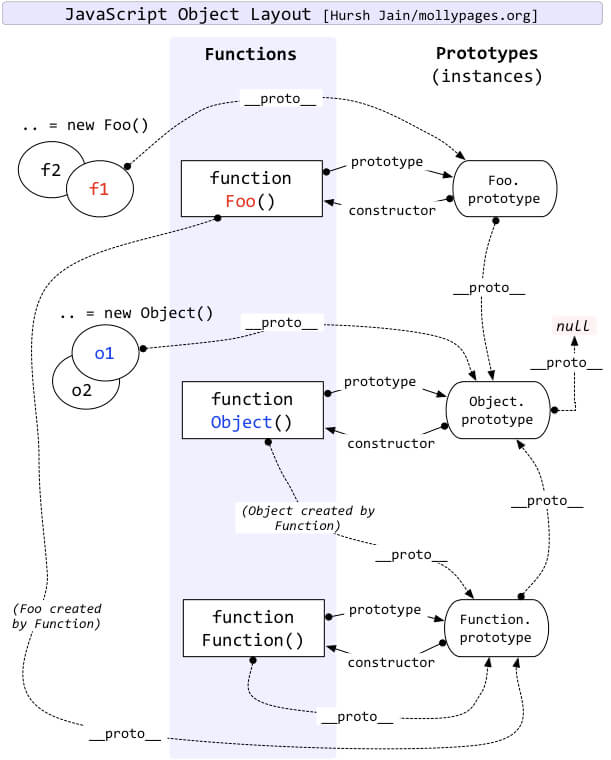

# JS

## 原型链



## this绑定的4种形式

### 1. 默认绑定

- 独立函数调用，可以把默认绑定看作是无法应用其他规则时的默认规则，this指向全局对象
- 严格模式下，不能将全局对象用于默认绑定，this会绑定到undefined，只有函数运行在非严格模式下，默认绑定才能绑定到全局对象。
在严格模式下调用函数则不影响默认绑定。

```js
function foo() {
  // 运行在严格模式下，this会绑定到undefined
  "use strict";

  console.log(this.a);
}

var a = 2;

// 调用
foo(); // TypeError: Cannot read property 'a' of undefined

// --------------------------------------

function foo() {
  // 运行
  console.log(this.a);
}

var a = 2;

(function() {
  // 严格模式下调用函数则不影响默认绑定
  "use strict";

  foo(); // 2
})();
```

### 2. 隐式绑定

- 当函数引用有上下文对象时，隐式绑定规则会把函数种的this绑定到这个上下文对象。
对象属性引用链中只有上一层或者说最后一层在调用中起作用。
- 被隐式绑定的函数特定情况下会丢失绑定对象，应用默认绑定，把this绑定到全局对象或者undefined上。

```js
function foo() {
  console.log(this.a);
}

var obj = {
  a: 2,
  foo: foo,
};

obj.foo(); // 2

// 虽然bar是obj.foo的一个引用，但是实际上，它引用的是foo函数本身。
// bar()是一个不带任何修饰的函数调用，应用默认绑定。
function foo() {
  console.log(this.a);
}

var obj = {
  a: 2,
  foo: foo,
};

var bar = obj.foo; // 函数别名

var a = "oops, global"; // a是全局对象的属性

bar(); // "oops, global"
```

### 3. 显式绑定

- 通过call或者apply方法。第一个参数是一个对象，在底用函数时将这个对象绑定到this。因为直接指定this的绑定对象，称之为显式绑定。

```js
function foo() {
  console.log(this.a);
}

var obj = {
  a: 2,
};

foo.call(obj); // 2  调用foo时强制把foo的this绑定到obj上


// 显式绑定无法解决丢失绑定的问题
// 解决办法1.硬绑定

function foo() {
  console.log( this.a );
}

var obj = {
  a: 2
};

var bar = function() {
  foo.call( obj );
};

bar(); // 2
setTimeout( bar, 100 ); // 2

// 硬绑定的bar不可能再修改它的this
bar.call( window ); // 2

// 解决办法2.API调用的“上下文”

function foo(el) {
  console.log( el, this.id );
}

var obj = {
    id: "awesome"
}

var myArray = [1, 2, 3]
// 调用foo(..)时把this绑定到obj
myArray.forEach( foo, obj );
// 1 awesome 2 awesome 3 awesome
```

### 4. new绑定

- 在js中，构造函数只是使用new操作符时被调用的普通函数，他们不属于某个类，也不会实例化一个类。
- 包括内置对象函数（比如Number）在内的所有函数都可以用new来调用，这种函数调用被称为构造函数调用。
- 实际上并不存在所谓的“构造函数”,只是对于函数的“构造调用”。

#### new实现

使用new来调用函数，或者说发生构造函数调用时，会自动执行下面的操作。

1. 创建（或者说构造）一个新对象。
2. 这个新对象会被执行[[Prototype]]连接。
3. 这个新对象会绑定到函数调用的this。
4. 如果函数没有返回其他对象，那么new表达式中的函数调用会自动返回这个新对象。

```js
function create() {
  // 创建一个空的对象
  var obj = new Object(),
    // 获得构造函数，arguments中去除第一个参数，即构造函数
    Constructor = [].shift.call(arguments);
  // 链接到原型，obj 可以访问到构造函数原型中的属性
  obj.__proto__ = Constructor.prototype;
  // 绑定 this 实现继承，obj 可以访问到构造函数中的属性
  var ret = Constructor.apply(obj, arguments);
  // 优先返回构造函数返回的对象
  return ret instanceof Object ? ret : obj;
}

function Person (name, age) {
    this.name = name;
    this.age = age;

    // 如果构造函数有返回值且为对象，则返回该对象 ret
    // return {
    //     name: name,
    //     age: '25'
    // }

    // 如果构造函数有返回值不是对象，则返回 obj
    // return 'Tom is a 18 boy';
}

// 用来替代 new Person('Tom', '18')
var person = create(Person, 'Tom', '18');
```
