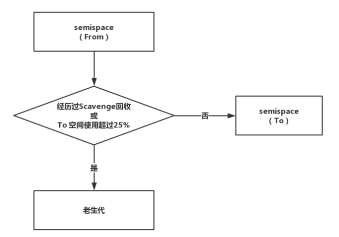
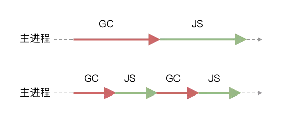

# JS

## 原型与原型链

### 原型对象

绝大部分的函数(少数内建函数除外)都有一个prototype属性,这个属性是原型对象用来创建新对象实例,而所有被创建的对象都会共享原型对象,因此这些对象便可以访问原型对象的属性。

### 原型链

原因是每个对象都有`__proto__`属性，此属性指向该对象的构造函数的原型。

对象可以通过`__proto__`与上游的构造函数的原型对象连接起来，而上游的原型对象也有一个`__proto__`，这样就形成了原型链。


## this绑定的4种形式

### 1. 默认绑定

- 独立函数调用，可以把默认绑定看作是无法应用其他规则时的默认规则，this指向全局对象
- 严格模式下，不能将全局对象用于默认绑定，this会绑定到undefined，只有函数运行在非严格模式下，默认绑定才能绑定到全局对象。
在严格模式下调用函数则不影响默认绑定。

```js
function foo() {
  // 运行在严格模式下，this会绑定到undefined
  "use strict";

  console.log(this.a);
}

var a = 2;

// 调用
foo(); // TypeError: Cannot read property 'a' of undefined

// --------------------------------------

function foo() {
  // 运行
  console.log(this.a);
}

var a = 2;

(function() {
  // 严格模式下调用函数则不影响默认绑定
  "use strict";

  foo(); // 2
})();
```

### 2. 隐式绑定

- 当函数引用有上下文对象时，隐式绑定规则会把函数种的this绑定到这个上下文对象。
对象属性引用链中只有上一层或者说最后一层在调用中起作用。
- 被隐式绑定的函数特定情况下会丢失绑定对象，应用默认绑定，把this绑定到全局对象或者undefined上。

```js
function foo() {
  console.log(this.a);
}

var obj = {
  a: 2,
  foo: foo,
};

obj.foo(); // 2

// 虽然bar是obj.foo的一个引用，但是实际上，它引用的是foo函数本身。
// bar()是一个不带任何修饰的函数调用，应用默认绑定。
function foo() {
  console.log(this.a);
}

var obj = {
  a: 2,
  foo: foo,
};

var bar = obj.foo; // 函数别名

var a = "oops, global"; // a是全局对象的属性

bar(); // "oops, global"
```

### 3. 显式绑定

- 通过call或者apply方法。第一个参数是一个对象，在底用函数时将这个对象绑定到this。因为直接指定this的绑定对象，称之为显式绑定。

```js
function foo() {
  console.log(this.a);
}

var obj = {
  a: 2,
};

foo.call(obj); // 2  调用foo时强制把foo的this绑定到obj上


// 显式绑定无法解决丢失绑定的问题
// 解决办法1.硬绑定

function foo() {
  console.log( this.a );
}

var obj = {
  a: 2
};

var bar = function() {
  foo.call( obj );
};

bar(); // 2
setTimeout( bar, 100 ); // 2

// 硬绑定的bar不可能再修改它的this
bar.call( window ); // 2

// 解决办法2.API调用的“上下文”

function foo(el) {
  console.log( el, this.id );
}

var obj = {
    id: "awesome"
}

var myArray = [1, 2, 3]
// 调用foo(..)时把this绑定到obj
myArray.forEach( foo, obj );
// 1 awesome 2 awesome 3 awesome
```

### 4. new绑定

- 在js中，构造函数只是使用new操作符时被调用的普通函数，他们不属于某个类，也不会实例化一个类。
- 包括内置对象函数（比如Number）在内的所有函数都可以用new来调用，这种函数调用被称为构造函数调用。
- 实际上并不存在所谓的“构造函数”,只是对于函数的“构造调用”。

#### new实现

使用new来调用函数，或者说发生构造函数调用时，会自动执行下面的操作。

1. 创建（或者说构造）一个新对象。
2. 这个新对象会被执行[[Prototype]]连接。
3. 这个新对象会绑定到函数调用的this。
4. 如果函数没有返回其他对象，那么new表达式中的函数调用会自动返回这个新对象。

```js
function create() {
  // 创建一个空的对象
  var obj = new Object(),
    // 获得构造函数，arguments中去除第一个参数，即构造函数
    Constructor = [].shift.call(arguments);
  // 链接到原型，obj 可以访问到构造函数原型中的属性
  obj.__proto__ = Constructor.prototype;
  // 绑定 this 实现继承，obj 可以访问到构造函数中的属性
  var ret = Constructor.apply(obj, arguments);
  // 优先返回构造函数返回的对象
  return ret instanceof Object ? ret : obj;
}

function Person (name, age) {
    this.name = name;
    this.age = age;

    // 如果构造函数有返回值且为对象，则返回该对象 ret
    // return {
    //     name: name,
    //     age: '25'
    // }

    // 如果构造函数有返回值不是对象，则返回 obj
    // return 'Tom is a 18 boy';
}

// 用来替代 new Person('Tom', '18')
var person = create(Person, 'Tom', '18');
```

## 执行上线文和作用域链

JavaScript代码的整个执行过程，分为两个阶段，代码编译阶段与代码执行阶段。编译阶段由编译器完成，将代码翻译成可执行代码，这个阶段**作用域**规则会确定。执行阶段由引擎完成，主要任务是执行可执行代码，**执行上下文**在这个阶段创建。

### 执行上下文

函数每调用一次，都会产生一个新的执行上下文环境。因为不同的调用可能就有不同的参数。

#### 执行上下文栈

执行全局代码时，会产生一个执行上下文环境，每次调用函数都又会执行上下文环境。当函数调用完成时，这个上下文环境以及其中的数据都会被消除（当然了闭包并不会乖乖就范），处于活动状态的执行上下文环境只有一个。

既然调用一个函数时一个新的执行上下文会被创建。那执行上下文的生命周期同样可以分为两个阶段。

- 创建阶段

  在这个阶段中，执行上下文会分别创建
  - 变量对象(Variable object，VO)
  - 建立作用域链(Scope chain)
  - 确定this的指向

- 代码执行阶段

  在此阶段，js引擎会重扫一遍函数，用具体的变量的值来更新可变对象，并执行代码内容。

#### 变量对象

在函数上下文中，我们用活动对象(Activation object, AO)来表示变量对象(Variable object，VO)。

活动对象其实就是被激活的变量对象，只是变量对象是规范上的或者说是引擎实现上的，不可在 JavaScript 环境中访问，只有到当进入一个执行上下文中，这个执行上下文的变量对象才会被激活，所以才叫 activation object，而只有活动对象上的各种属性才能被访问。

变量对象会包括：

1. 语言内置
    - this
    - arguments

2. 函数的所有形参 (如果是函数上下文)
     - 由名称和对应值组成的一个变量对象的属性被创建
     - 没有实参，属性值设为 undefined

3. 函数声明
     - 由名称和对应值（函数对象(function-object)）组成一个变量对象的属性被创建
     - 如果变量对象已经存在相同名称的属性，则完全替换这个属性

4. 变量声明
     - 由名称和对应值（undefined）组成一个变量对象的属性被创建；
     - 如果变量名称跟已经声明的形式参数或函数相同，则变量声明不会干扰已经存在的这类属性

### 作用域

作用域(scope chain)是每一个执行上下文自身持有的活动对象的集合，如在本执行上下文中声明的变量和函数以及方法参数传入的对象。

每一个执行上下文可以访问的对象包括自身的作用域和父执行上下文的作用域和父父执行上下文作用域直到全局作用域，这就产生了作用域链。作用域链的用途是保证对执行环境有权访问的所有变量和函数的有序访问。

作用域规定了如何查找变量，也就是确定当前执行代码对变量的访问权限。
JavaScript 采用词法作用域(lexical scoping)，也就是静态作用域。

作用域只是一个“地盘”，其中没有变量。变量是通过作用域对应的执行上下文环境中的变量对象来实现的。所以作用域是静态观念的，而执行上下文环境是动态上的，两者并不一样。有闭包存在时，一个作用域存在两个上下文环境也是有的。也就是说，作用域只是用于划分你在这个作用域里面定义的变量的有效范围，出了这个作用域就无效。

同一个作用域下，对同一个函数的不同的调用会产生不同的执行上下文环境，继而产生不同的变量的值，所以，作用域中变量的值是在执行过程中确定的，而作用域是在函数创建时就确定的。

如果要查找一个作用域下某个变量的值，就需要找到这个作用域对应的执行上下文环境，再在其中找到变量的值。

```js
var a = 1
function out(){
    var a = 2
    inner()
}
function inner(){
    console.log(a)
}
out()  //====>  1
```

#### 自由变量

函数在定义的时候（不是调用的时候）就已经确定了函数体内部自由变量的作用域。

```js
let a = 100
function fn() {
  let b = 20
  function bar() {
    console.log(a + b) // a是在fn作用域使用，但是并没有在fn作用域定义，这就是自由变量。
  }
  return bar
}

let x = fn(), b = 200
x()
```

bar要取得a的值，就要到创建bar这个函数的作用域中取值（这里是fn作用域），fn作用域也没有a，就到创建fn这个函数的作用域中取值（这里是全局作用域），找到了就结束了。这就是作用域链。

#### 作用域链

当查找变量的时候，会先从当前上下文的变量对象中查找，如果没有找到，就会从父级(词法层面上的父级)执行上下文的变量对象中查找，一直找到全局上下文的变量对象，也就是全局对象。这样由多个执行上下文的变量对象构成的链表就叫做作用域链。

其本质是JavaScript在执行过程中会创造可执行上下文，可执行上下文中的词法环境中含有外部词法环境的引用，我们可以通过这个引用获取外部词法环境的变量、声明等，这些引用串联起来一直指向全局的词法环境，因此形成了作用域链。

## new操作符的工作原理

1. 新建一个对象
2. 设置原型链
3. 让F中的this指向instance，执行F的函数体
4. 判断F的返回值类型
   - 如果是值类型，返回instance
   - 如果是引用类型，就返回这个引用类型的对象，替换掉instance

```js
function create () {
   // 创建一个空对象
  let obj = new Object();
  // 获取构造函数
  let Constructor = [].shift.call(arguments);
  // 链接到原型
  obj.__proto__ =  Constructor.prototype;
  // 绑定this值
  let result = Constructor.apply(obj, arguments);
  //. 返回新对象
  return typeof result === "object" ? result : obj
}

function Person(name) {
  this.name = name;
}

var a = create(Person, 'xiaoming')
```

## 防抖与节流

### 防抖（debounce）

```js
// 防抖函数
const debounce = (fn, delay) => {
  let timer = null;
  return (...args) => {
    clearTimeout(timer);
    timer = setTimeout(() => {
      fn.apply(this, args);
    }, delay);
  };
};
```

使用场景

- 按钮提交场景：防止多次提交按钮，只执行最后提交的一次
- 服务端验证场景：表单验证需要服务端配合，只执行一段连续的输入事件的最后一次，还有搜索联想词功能类似

### 节流（throttle）

```js
const throttle = (fn, delay = 500) => {
  let flag = true;
  return (...args) => {
    if (!flag) return;
    flag = false;
    setTimeout(() => {
      fn.apply(this, args);
      flag = true;
    }, delay);
  };
};
```

使用场景

- 拖拽场景：固定时间内只执行一次，防止超高频次触发位置变动
- 缩放场景：监控浏览器resize
- 动画场景：避免短时间内多次触发动画引起性能问题

## 深克隆

```js
/**
 * deep clone
 * @param  {[type]} parent object 需要进行克隆的对象
 * @return {[type]}        深克隆后的对象
 */
const clone = parent => {
  // 判断类型
  const isType = (obj, type) => {
    if (typeof obj !== "object") return false;
    const typeString = Object.prototype.toString.call(obj);
    let flag;
    switch (type) {
      case "Array":
        flag = typeString === "[object Array]";
        break;
      case "Date":
        flag = typeString === "[object Date]";
        break;
      case "RegExp":
        flag = typeString === "[object RegExp]";
        break;
      default:
        flag = false;
    }
    return flag;
  };

  // 处理正则
  const getRegExp = re => {
    var flags = "";
    if (re.global) flags += "g";
    if (re.ignoreCase) flags += "i";
    if (re.multiline) flags += "m";
    return flags;
  };
  // 维护两个储存循环引用的数组
  const parents = [];
  const children = [];

  const _clone = parent => {
    if (parent === null) return null;
    if (typeof parent !== "object") return parent;

    let child, proto;

    if (isType(parent, "Array")) {
      // 对数组做特殊处理
      child = [];
    } else if (isType(parent, "RegExp")) {
      // 对正则对象做特殊处理
      child = new RegExp(parent.source, getRegExp(parent));
      if (parent.lastIndex) child.lastIndex = parent.lastIndex;
    } else if (isType(parent, "Date")) {
      // 对Date对象做特殊处理
      child = new Date(parent.getTime());
    } else {
      // 处理对象原型
      proto = Object.getPrototypeOf(parent);
      // 利用Object.create切断原型链
      child = Object.create(proto);
    }

    // 处理循环引用
    const index = parents.indexOf(parent);

    if (index != -1) {
      // 如果父数组存在本对象,说明之前已经被引用过,直接返回此对象
      return children[index];
    }
    parents.push(parent);
    children.push(child);

    for (let i in parent) {
      // 递归
      child[i] = _clone(parent[i]);
    }

    return child;
  };
  return _clone(parent);
};

```

局限性:

1. 一些特殊情况没有处理: 例如Buffer对象、Promise、Set、Map
2. 另外对于确保没有循环引用的对象，我们可以省去对循环引用的特殊处理，因为这很消耗时间

## 实现订阅发布模式

```js
class EventEmeitter {
  constructor() {
    this._events = this._events || new Map(); // 储存事件/回调键值对
    this._maxListeners = this._maxListeners || 10; // 设立监听上限
  }
}

// 触发名为type的事件
EventEmeitter.prototype.emit = function(type, ...args) {
  let handler;
  handler = this._events.get(type);
  if (Array.isArray(handler)) {
    // 如果是一个数组说明有多个监听者,需要依次此触发里面的函数
    for (let i = 0; i < handler.length; i++) {
      if (args.length > 0) {
        handler[i].apply(this, args);
      } else {
        handler[i].call(this);
      }
    }
  } else {
    // 单个函数的情况我们直接触发即可
    if (args.length > 0) {
      handler.apply(this, args);
    } else {
      handler.call(this);
    }
  }

  return true;
};

// 监听名为type的事件
EventEmeitter.prototype.addListener = function(type, fn) {
  const handler = this._events.get(type); // 获取对应事件名称的函数清单
  if (!handler) {
    this._events.set(type, fn);
  } else if (handler && typeof handler === "function") {
    // 如果handler是函数说明只有一个监听者
    this._events.set(type, [handler, fn]); // 多个监听者我们需要用数组储存
  } else {
    handler.push(fn); // 已经有多个监听者,那么直接往数组里push函数即可
  }
};

EventEmeitter.prototype.removeListener = function(type, fn) {
  const handler = this._events.get(type); // 获取对应事件名称的函数清单

  // 如果是函数,说明只被监听了一次
  if (handler && typeof handler === "function") {
    this._events.delete(type, fn);
  } else {
    let postion;
    // 如果handler是数组,说明被监听多次要找到对应的函数
    for (let i = 0; i < handler.length; i++) {
      if (handler[i] === fn) {
        postion = i;
      } else {
        postion = -1;
      }
    }
    // 如果找到匹配的函数,从数组中清除
    if (postion !== -1) {
      // 找到数组对应的位置,直接清除此回调
      handler.splice(postion, 1);
      // 如果清除后只有一个函数,那么取消数组,以函数形式保存
      if (handler.length === 1) {
        this._events.set(type, handler[0]);
      }
    } else {
      return this;
    }
  }
};
```

## 实现Promise

```js
var PromisePolyfill = (function () {
  // 和reject不同的是resolve需要尝试展开thenable对象
  function tryToResolve (value) {
    if (this === value) {
    // 主要是防止下面这种情况
    // let y = new Promise(res => setTimeout(res(y)))
      throw TypeError('Chaining cycle detected for promise!')
    }

    // 根据规范2.32以及2.33 对对象或者函数尝试展开
    // 保证S6之前的 polyfill 也能和ES6的原生promise混用
    if (value !== null &&
      (typeof value === 'object' || typeof value === 'function')) {
      try {
      // 这里记录这次then的值同时要被try包裹
      // 主要原因是 then 可能是一个getter, 也也就是说
      //   1. value.then可能报错
      //   2. value.then可能产生副作用(例如多次执行可能结果不同)
        var then = value.then

        // 另一方面, 由于无法保证 then 确实会像预期的那样只调用一个onFullfilled / onRejected
        // 所以增加了一个flag来防止resolveOrReject被多次调用
        var thenAlreadyCalledOrThrow = false
        if (typeof then === 'function') {
        // 是thenable 那么尝试展开
        // 并且在该thenable状态改变之前this对象的状态不变
          then.bind(value)(
          // onFullfilled
            function (value2) {
              if (thenAlreadyCalledOrThrow) return
              thenAlreadyCalledOrThrow = true
              tryToResolve.bind(this, value2)()
            }.bind(this),

            // onRejected
            function (reason2) {
              if (thenAlreadyCalledOrThrow) return
              thenAlreadyCalledOrThrow = true
              resolveOrReject.bind(this, 'rejected', reason2)()
            }.bind(this)
          )
        } else {
        // 拥有then 但是then不是一个函数 所以也不是thenable
          resolveOrReject.bind(this, 'resolved', value)()
        }
      } catch (e) {
        if (thenAlreadyCalledOrThrow) return
        thenAlreadyCalledOrThrow = true
        resolveOrReject.bind(this, 'rejected', e)()
      }
    } else {
    // 基本类型 直接返回
      resolveOrReject.bind(this, 'resolved', value)()
    }
  }

  function resolveOrReject (status, data) {
    if (this.status !== 'pending') return
    this.status = status
    this.data = data
    if (status === 'resolved') {
      for (var i = 0; i < this.resolveList.length; ++i) {
        this.resolveList[i]()
      }
    } else {
      for (i = 0; i < this.rejectList.length; ++i) {
        this.rejectList[i]()
      }
    }
  }

  function Promise (executor) {
    if (!(this instanceof Promise)) {
      throw Error('Promise can not be called without new !')
    }

    if (typeof executor !== 'function') {
    // 非标准 但与Chrome谷歌保持一致
      throw TypeError('Promise resolver ' + executor + ' is not a function')
    }

    this.status = 'pending'
    this.resolveList = []
    this.rejectList = []

    try {
      executor(tryToResolve.bind(this), resolveOrReject.bind(this, 'rejected'))
    } catch (e) {
      resolveOrReject.bind(this, 'rejected', e)()
    }
  }

  Promise.prototype.then = function (onFullfilled, onRejected) {
  // 返回值穿透以及错误穿透, 注意错误穿透用的是throw而不是return，否则的话
  // 这个then返回的promise状态将变成resolved即接下来的then中的onFullfilled
  // 会被调用, 然而我们想要调用的是onRejected
    if (typeof onFullfilled !== 'function') {
      onFullfilled = function (data) {
        return data
      }
    }
    if (typeof onRejected !== 'function') {
      onRejected = function (reason) {
        throw reason
      }
    }

    var executor = function (resolve, reject) {
      setTimeout(function () {
        try {
        // 拿到对应的handle函数处理this.data
        // 并以此为依据解析这个新的Promise
          var value = this.status === 'resolved'
            ? onFullfilled(this.data)
            : onRejected(this.data)
          resolve(value)
        } catch (e) {
          reject(e)
        }
      }.bind(this))
    }

    // then 接受两个函数返回一个新的Promise
    // then 自身的执行永远异步与onFullfilled/onRejected的执行
    if (this.status !== 'pending') {
      return new Promise(executor.bind(this))
    } else {
    // pending
      return new Promise(function (resolve, reject) {
        this.resolveList.push(executor.bind(this, resolve, reject))
        this.rejectList.push(executor.bind(this, resolve, reject))
      }.bind(this))
    }
  }

  // for prmise A+ test
  Promise.deferred = Promise.defer = function () {
    var dfd = {}
    dfd.promise = new Promise(function (resolve, reject) {
      dfd.resolve = resolve
      dfd.reject = reject
    })
    return dfd
  }

  // for prmise A+ test
  if (typeof module !== 'undefined') {
    module.exports = Promise
  }

  return Promise
})()

PromisePolyfill.all = function (promises) {
  return new Promise((resolve, reject) => {
    const result = []
    let cnt = 0
    for (let i = 0; i < promises.length; ++i) {
      promises[i].then(value => {
        cnt++
        result[i] = value
        if (cnt === promises.length) resolve(result)
      }, reject)
    }
  })
}

PromisePolyfill.race = function (promises) {
  return new Promise((resolve, reject) => {
    for (let i = 0; i < promises.length; ++i) {
      promises[i].then(resolve, reject)
    }
  })
}
```

## 内存管理

### 内存回收

V8的垃圾回收策略基于分代回收机制，该机制又基于世代假说,该假说有两个特点:

- 大部分新生对象倾向于早死
- 不死的对象，会活得更久

基于这个理论，现代垃圾回收算法根据对象的存活时间将内存进行了分代，并对不同分代的内存采用不同的高效算法进行垃圾回收

### V8的内存分代

在V8中，将内存分为了新生代（new space）和老生代（old space）。它们特点如下：

- 新生代：对象的存活时间较短。新生对象或只经过一次垃圾回收的对象。
- 老生代：对象存活时间较长。经历过一次或多次垃圾回收的对象。

### Scavenge 算法

Scavenge 算法的缺点是，它的算法机制决定了只能利用一半的内存空间。但是新生代中的对象生存周期短、存活对象少，进行对象复制的成本不是很高，因而非常适合这种场景。

新生代中的对象主要通过 Scavenge 算法进行垃圾回收。Scavenge 的具体实现，主要采用了Cheney算法。


Cheney算法采用复制的方式进行垃圾回收。它将堆内存一分为二，每一部分空间称为 semispace。这两个空间，只有一个空间处于使用中，另一个则处于闲置。使用中的 semispace 称为 「From 空间」，闲置的 semispace 称为 「To 空间」。

过程如下：

- 从 From 空间分配对象，若 semispace 被分配满，则执行 Scavenge 算法进行垃圾回收。
- 检查 From 空间的存活对象，若对象存活，则检查对象是否符合晋升条件，若符合条件则晋升到老生代，否则将对象从 From 空间复制到 To 空间。
- 若对象不存活，则释放不存活对象的空间。
- 完成复制后，将 From 空间与 To 空间进行角色翻转（flip）。

### 对象晋升

- 对象是否经历过Scavenge回收。对象从 From 空间复制 To 空间时，会检查对象的内存地址来判断对象是否已经经过一次Scavenge回收。若经历过，则将对象从 From 空间复制到老生代中；若没有经历，则复制到 To 空间。
- To 空间的内存使用占比是否超过限制。当对象从From 空间复制到 To 空间时，若 To 空间使用超过 25%，则对象直接晋升到老生代中。设置为25%的比例的原因是，当完成 Scavenge 回收后，To 空间将翻转成From 空间，继续进行对象内存的分配。若占比过大，将影响后续内存分配。

对象晋升到老生代后，将接受新的垃圾回收算法处理。下图为Scavenge算法中，对象晋升流程图。



### Mark-Sweep & Mark-Compact

老生代中的对象有两个特点，第一是存活对象多，第二个存活时间长。若在老生代中使用 Scavenge 算法进行垃圾回收，将会导致复制存活对象的效率不高，且还会浪费一半的空间。因而，V8在老生代采用Mark-Sweep 和 Mark-Compact 算法进行垃圾回收。

Mark-Sweep，是标记清除的意思。它主要分为标记和清除两个阶段。

- 标记阶段，它将遍历堆中所有对象，并对存活的对象进行标记；
清除阶段，对未标记对象的空间进行回收。
- 与 Scavenge 算法不同，Mark-Sweep 不会对内存一分为二，因此不会浪费空间。但是，经历过一次 Mark-Sweep 之后，内存的空间将会变得不连续，这样会对后续内存分配造成问题。比如，当需要分配一个比较大的对象时，没有任何一个碎片内支持分配，这将提前触发一次垃圾回收，尽管这次垃圾回收是没有必要的。

为了解决内存碎片的问题，提高对内存的利用，引入了 Mark-Compact （标记整理）算法。Mark-Compact 是在 Mark-Sweep 算法上进行了改进，标记阶段与Mark-Sweep相同，但是对未标记的对象处理方式不同。与Mark-Sweep是对未标记的对象立即进行回收，Mark-Compact则是将存活的对象移动到一边，然后再清理端边界外的内存。

由于Mark-Compact需要移动对象，所以执行速度上，比Mark-Sweep要慢。所以，V8主要使用Mark-Sweep算法，然后在当空间内存分配不足时，采用Mark-Compact算法。

### Incremental Marking（增量标记）

在新生代中，由于存活对象少，垃圾回收效率高，全停顿时间短，造成的影响小。但是老生代中，存活对象多，垃圾回收时间长，全停顿造成的影响大。为了减少全停顿的时间，V8对标记进行了优化，将一次停顿进行的标记过程，分成了很多小步。每执行完一小步就让应用逻辑执行一会儿，这样交替多次后完成标记。如下图所示：



长时间的GC，会导致应用暂停和无响应，将会导致糟糕的用户体验。从2011年起，v8就将「全暂停」标记换成了增量标记。改进后的标记方式，最大停顿时间减少到原来的1/6。

### 参考文献

- JavaScript内存管理：[https://www.cxymsg.com/guide/memory.html#%E5%86%85%E5%AD%98%E5%9B%9E%E6%94%B6](https://www.cxymsg.com/guide/memory.html#%E5%86%85%E5%AD%98%E5%9B%9E%E6%94%B6)

## 前端路由的实现

### H5 History API

```js
class Routers {
  constructor() {
    this.routes = {};
    // 在初始化时监听popstate事件
    this._bindPopState();
  }
  // 初始化路由
  init(path) {
    history.replaceState({path: path}, null, path);
    this.routes[path] && this.routes[path]();
  }
  // 将路径和对应回调函数加入hashMap储存
  route(path, callback) {
    this.routes[path] = callback || function() {};
  }

  // 触发路由对应回调
  go(path) {
    history.pushState({path: path}, null, path);
    this.routes[path] && this.routes[path]();
  }
  // 监听popstate事件
  _bindPopState() {
    window.addEventListener('popstate', e => {
      const path = e.state && e.state.path;
      this.routes[path] && this.routes[path]();
    });
  }
}
```
