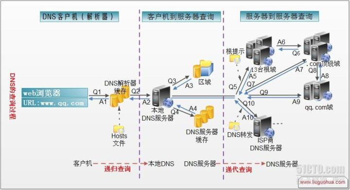
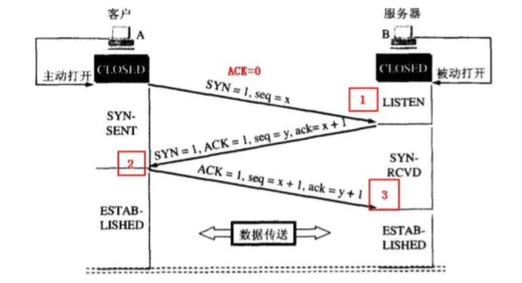
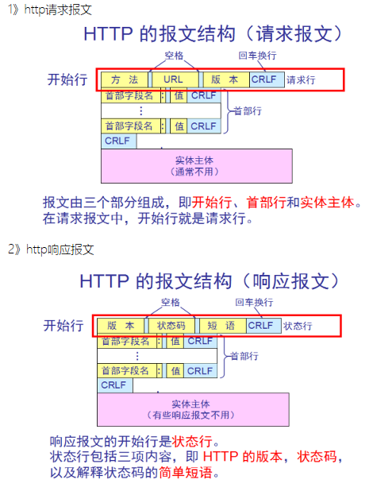

# 网络

## DNS域名解析



1. 浏览器将会检查缓存中有没有这个域名对应的解析过的IP地址，如果有该解析过程将会结束。浏览器缓存域名也是有限制的，包括缓存的时间、大小，可以通过TTL属性来设置。

2. 如果用户的浏览器中缓存中没有，操作系统会先检查自己本地的hosts文件是否有这个网址映射关系，如果有，就先调用这个IP地址映射，完成域名解析。

3. 如果hosts里没有这个域名的映射，则查找本地DNS解析器缓存，是否有这个网址映射关系，如果有，直接返回，完成域名解析。

4. 如果hosts与本地DNS解析器缓存都没有相应的网址映射关系，首先会找TCP/ip参数中设置的首选DNS服务器，在此我们叫它本地DNS服务器，此服务器收到查询时，如果要查询的域名，包含在本地配置区域资源中，则返回解析结果给客户机，完成域名解析，此解析具有权威性。

5. 如果要查询的域名，不由本地DNS服务器区域解析，但该服务器已缓存了此网址映射关系，则调用这个IP地址映射，完成域名解析，此解析不具有权威性。

6. 如果本地DNS服务器本地区域文件与缓存解析都失效，则根据本地DNS服务器的设置（是否设置转发器）进行查询，如果未用转发模式，本地DNS就把请求发至13台根DNS，根DNS服务器收到请求后会判断这个域名(.com)是谁来授权管理，并会返回一个负责该顶级域名服务器的一个IP。本地DNS服务器收到IP信息后，将会联系负责.com域的这台服务器。这台负责.com域的服务器收到请求后，如果自己无法解析，它就会找一个管理.com域的下一级DNS服务器地址给本地DNS服务器。当本地DNS服务器收到这个地址后，就会找域名域服务器，重复上面的动作，进行查询，直至找到域名对应的主机。

7. 如果用的是转发模式，此DNS服务器就会把请求转发至上一级DNS服务器，由上一级服务器进行解析，上一级服务器如果不能解析，或找根DNS或把转请求转至上上级，以此循环。不管是本地DNS服务器用是是转发，还是根提示，最后都是把结果返回给本地DNS服务器，由此DNS服务器再返回给客户机。

### 参考文献

- 一次dns缓存引发的惨案：[https://zhuanlan.zhihu.com/p/25152493](https://zhuanlan.zhihu.com/p/25152493)

## TCP建立连接为何是三次握手



SYN/ACK：标志位，只为1或者0

- SYN：1 表示发起连接
- ACK：1 表示确认收到
- seq：一个随机序号的数据包
- ack：确认号，表示对这次数据包的确认，以及对下次收到数据包的期待

需要注意的是：

- 不要将确认号ack与标志位中的ACK搞混了
- 确认方ack=发起方seq+1，两端配对

大致过程：

客户端SYN=1发起连接，并发送一个seq=x的数据包（TCP规定SYN=1时必须发送一个序号包）

服务端ACK=1确认收到，ack=x+1表示我方到x为止的数据包已收到，期待客户端下次发我一个seq为x+1的数据包，SYN=1发起连接，并发送一个seq=y的数据包

客户端ACK=1确认收到。ack=y+1表示我方到y为止的数据包已收到，并发送一个seq=x+1的数据包

### 三次握手原因

在谢希仁著《计算机网络》第四版中讲“三次握手”的目的是“为了防止已失效的连接请求报文段突然又传送到了服务端，因而产生错误”。

在另一部经典的《计算机网络》一书中讲“三次握手”的目的是为了解决“网络中存在延迟的重复分组”的问题。

这两种不用的表述其实阐明的是同一个问题。

谢希仁版《计算机网络》中的例子是这样的，“已失效的连接请求报文段”的产生在这样一种情况下：client发出的第一个连接请求报文段并没有丢失，而是在某个网络结点长时间的滞留了，以致延误到连接释放以后的某个时间才到达server。

本来这是一个早已失效的报文段。但server收到此失效的连接请求报文段后，就误认为是client再次发出的一个新的连接请求。

于是就向client发出确认报文段，同意建立连接。假设不采用“三次握手”，那么只要server发出确认，新的连接就建立了。

由于现在client并没有发出建立连接的请求，因此不会理睬server的确认，也不会向server发送数据。但server却以为新的运输连接已经建立，并一直等待client发来数据。这样，server的很多资源就白白浪费掉了。采用“三次握手”的办法可以防止上述现象发生。
例如刚才那种情况，client不会向server的确认发出确认。
server由于收不到确认，就知道client并没有要求建立连接。

### 参考文献

- TCP 为什么是三次握手，而不是两次或四次？：[https://www.zhihu.com/question/24853633/answer/63668444](https://www.zhihu.com/question/24853633/answer/63668444)
- 前端该了解的HTTP和HTTPS：[https://juejin.im/post/5e6851f96fb9a07ca24f63a7](https://juejin.im/post/5e6851f96fb9a07ca24f63a7)

## GET与POST的区别

1. get重点在从服务器上获取资源，post重点在向服务器发送数据
2. get传输数据是通过URL请求，以field（字段）= value的形式，置于URL后，并用'?'连接，多个请求数据间用'&'连接，这个过程用户是可见的；post传输数据通过将字段与对应值存在请求实体中发送给服务器，这个过程对用户是不可见的
3. get传输的数据量小，因为受URL长度限制，但效率较高，post可以传输大量数据，所以上传文件时只能用post方法
4. get是不安全的，因为post是可见的，可能会泄露私密信息，密码等；post安全性较高
5. get方法只支持ASCII字符，向服务器传的中文字符可能会乱码；post支持标准字符集，可以传递中文字符

## 浏览器缓存

1. 浏览器在加载资源时，先根据这个资源的一些http header判断它是否命中强缓存，强缓存如果命中，浏览器直接从自己的缓存中读取资源，不会发请求到服务器。比如某个css文件，如果浏览器在加载它所在的网页时，这个css文件的缓存配置命中了强缓存，浏览器就直接从缓存中加载这个css，连请求都不会发送到网页所在服务器；
2. 当强缓存没有命中的时候，浏览器一定会发送一个请求到服务器，通过服务器端依据资源的另外一些http header验证这个资源是否命中协商缓存，如果协商缓存命中，服务器会将这个请求返回，但是不会返回这个资源的数据，而是告诉客户端可以直接从缓存中加载这个资源，于是浏览器就又会从自己的缓存中去加载这个资源；
3. 强缓存与协商缓存的共同点是：如果命中，都是从客户端缓存中加载资源，而不是从服务器加载资源数据；区别是：强缓存不发请求到服务器，协商缓存会发请求到服务器。
4. 当协商缓存也没有命中的时候，浏览器直接从服务器加载资源数据。

### 强缓存

### Expires

`Expires`是较老的强缓存管理header，是http1.0提出的一个表示资源过期时间的header，由于它是服务器返回的一个绝对时间，在服务器时间与客户端时间相差较大时，缓存管理容易出现问题，比如随意修改下客户端时间，就能影响缓存命中的结果

### Cache-Control

所以在http1.1的时候，提出了一个新的header，就是`Cache-Control`，这是一个相对时间，在配置缓存的时候，以秒为单位，用数值表示，如：`Cache-Control:max-age=315360000`

`Cache-Control`描述的是一个相对时间，在进行缓存命中的时候，都是利用客户端时间进行判断，所以相比较`Expires`，`Cache-Control`的缓存管理更有效，安全一些。

这两个header可以只启用一个，也可以同时启用，当response header中，`Expires`和`Cache-Control`同时存在时，`Cache-Control`优先级高于`Expires`

目前主流的做法使用Cache-Control控制缓存，除了max-age控制过期时间外，还有一些不得不提

- Cache-Control: public可以被所有用户缓存，包括终端和CDN等中间代理服务器
- Cache-Control: private只能被终端浏览器缓存，不允许中继缓存服务器进行缓存
- Cache-Control: no-cache,先缓存本地，但是在命中缓存之后必须与服务器验证缓存的新鲜度才能使用
- Cache-Control: no-store，不会产生任何缓存

### 协商缓存

当浏览器对某个资源的请求没有命中强缓存，就会发一个请求到服务器，验证协商缓存是否命中，如果协商缓存命中，
请求响应返回的http状态为304并且会显示一个`Not Modified`的字符串

协商缓存是利用的是`Last-Modified`，`If-Modified-Since`和`ETag`、`If-None-Match`这两对Header来管理的

|client|server|
|---|---|
|`If-None-Match`表示资源上一次返回的`Etag`|`Etag`根据资源生成的唯一标识|
|`If-Modified`表示资源上一次返回的`LastModified`|`LastModified`资源最后修改时间|

#### Last-Modified/If-Modified-Since

客户端首次请求资源时，服务器会把资源的最新修改时间Last-Modified:Thu, 19 Feb 2019 08:20:55 GMT通过响应部首发送给客户端，当再次发送请求是，客户端将服务器返回的修改时间放在请求头If-Modified-Since:Thu, 19 Feb 2019 08:20:55 GMT发送给服务器，服务器再跟服务器上的对应资源进行比对，如果服务器的资源更新，那么返回最新的资源，此时状态码200，当服务器资源跟客户端的请求的部首时间一致，证明客户端的资源是最新的，返回304状态码，表示客户端直接用缓存即可。

#### ETag/If-None-Match

ETag的流程跟Last-Modified是类似的，区别就在于ETag是根据资源内容进行hash，生成一个信息摘要，只要资源内容有变化，这个摘要就会发生巨变，通过这个摘要信息比对，即可确定客户端的缓存资源是否为最新，这比Last-Modified的精确度要更高

### 图示


### 参考文献

- 浏览器缓存知识小结及应用：[https://www.cnblogs.com/lyzg/p/5125934.html?from=cnblogs](https://www.cnblogs.com/lyzg/p/5125934.html?from=cnblogs)
- HTTP的缓存的过程是怎样的？：[https://www.cxymsg.com/guide/http.html#http%E7%9A%84%E7%BC%93%E5%AD%98%E7%9A%84%E8%BF%87%E7%A8%8B%E6%98%AF%E6%80%8E%E6%A0%B7%E7%9A%84%EF%BC%9F](https://www.cxymsg.com/guide/http.html#http%E7%9A%84%E7%BC%93%E5%AD%98%E7%9A%84%E8%BF%87%E7%A8%8B%E6%98%AF%E6%80%8E%E6%A0%B7%E7%9A%84%EF%BC%9F)

### 刷新

- `f5`跳过强缓存，但是会检查协商缓存
- `ctrl + f5`直接从服务器加载，跳过强缓存和协商缓存

## HTTP/2

### 1. 二进制分帧

- HTTP/2性能提升的核心就在于二进制分帧层。HTTP/2是二进制协议，他采用二进制格式传输数据而不是1.x的文本格式。
- HTTP/2中，同域名下所有通信都在单个连接上完成。
- 单个连接可以承载任何数量的双向数据流。
- 每个数据流都已消息的形式发送，而消息又由一个或多个帧组成，多个帧之间可以乱序发送，根据帧首部的流标识可以重新组装。

### 2. HTTP/2对头部进行压缩

- 在客户端与服务端使用“首部表”来跟踪和存储之前发送的键值对，对于相同的数据，不再通过每次请求和响应发送。
- 首部表再HTTP/2的连续存续期内始终存在，由客户端和服务器共同渐进地更新。
- 每个新的首部键值对要么被追加到当前表的末尾，要么替换表中之前的值。

### 3. HTTP/2多路复用解决HTTP/1.x的线头阻塞和多个TCP连接的问题

之所以速度能有如此优化，主要得益于HTTP2.0的多路复用技术。

有了新的分帧机制后，HTTP/2不再依赖多个TCP 连接去处理更多并发的请求，每个数据流都拆分成很多互不依赖的帧，而这些帧可以交错（乱序发送），还可以分优先级。最后再在另一端根据每个帧首部的流标识符把它们重新组合起来。从始至终，客户端与服务器之间只需要一个连接(同个域名下)即可

### 4. 数据流

因为 HTTP/2 的数据包是不按顺序发送的，同一个连接里面连续的数据包，可能属于不同的回应。因此，必须要对数据包做标记，指出它属于哪个回应。

HTTP/2 将每个请求或回应的所有数据包，称为一个数据流（stream）。每个数据流都有一个独一无二的编号。数据包发送的时候，都必须标记数据流ID，用来区分它属于哪个数据流。另外还规定，客户端发出的数据流，ID一律为奇数，服务器发出的，ID为偶数。

数据流发送到一半的时候，客户端和服务器都可以发送信号（RST_STREAM帧），取消这个数据流。1.1版取消数据流的唯一方法，就是关闭TCP连接。
这就是说，HTTP/2 可以取消某一次请求，同时保证TCP连接还打开着，可以被其他请求使用。
客户端还可以指定数据流的优先级。优先级越高，服务器就会越早回应。

### 5. 服务器推送

HTTP/2 允许服务器未经请求，主动向客户端发送资源，这叫做服务器推送（server push）。常见场景是客户端请求一个网页，这个网页里面包含很多静态资源。服务端能在客户端请求静态资源前主动把这些静态资源随着网页一起发给客户端了，省去了客户端建立连接、发起请求等过程，极大提升了速度

### 存在的问题

在HTTP/2中，多个请求时跑在同一个TCP管道当中。但当出现了丢包时，HTTP/2整个TCP都要开始等待重传，那么会阻塞该TCP连接中的所有请求。而对于HTTP/1.1来说，可以开启多个TCP连接，出现这种i情况反倒只回影响其中一个连接，剩余的TCP连接还可以正常传输数据

## 跨域

跨域是指一个域下的文档或脚本试图去请求另一个域下的资源，这里跨域是广义的。
其实我们通常所说的跨域是狭义的，是由浏览器同源策略限制的一类请求场景。

### 同源策略

同源策略/SOP（Same origin policy）是一种约定，由Netscape公司1995年引入浏览器，它是浏览器最核心也最基本的安全功能，如果缺少了同源策略，浏览器很容易受到XSS、CSFR等攻击。所谓同源是指"协议+域名+端口"三者相同，即便两个不同的域名指向同一个ip地址，也非同源。

#### 同源策略目的

防止CSRF（跨站请求伪造）攻击
Cookie、LocalStorage、IndexedDB 等存储性内容
DOM 节点
AJAX 请求发送后，结果被浏览器拦截了

### 跨域解决方案

1. [跨域资源共享（CORS）](#CORS（跨域资源共享）)
2. [通过JSONP跨域](#JSONP)
3. [document.domain+iframe跨域](#document.domain+iframe跨域)
4. [location.hash+iframe跨域](#location.hash+iframe跨域)
5. [postMessage跨域](#postMessage跨域)
6. [WebSocket协议跨域](#WebSocket协议跨域)
7. [服务器代理](#服务器代理)

#### CORS（跨域资源共享）

普通跨域请求：只服务端设置Access-Control-Allow-Origin即可，前端无须设置，若要带cookie请求：前后端都需要设置。

需注意的是：由于同源策略的限制，所读取的cookie为跨域请求接口所在域的cookie，而非当前页。如果想实现当前页cookie的写入

目前，所有浏览器都支持该功能(IE8+：IE8/9需要使用XDomainRequest对象来支持CORS）)，CORS也已经成为主流的跨域解决方案。

```js
// 前端设置是否带cookie
xhr.withCredentials = true;
```

##### CORS请求种类

浏览器将CORS请求分成两类：简单请求（simple request）和非简单请求（not-so-simple request）。

##### 简单请求

只要同时满足以下两大条件，就属于简单请求。

1. 请求方法是以下三种方法之一：

   - HEAD
   - GET
   - POST

2. HTTP的头信息不超出以下几种字段：

   - Accept
   - Accept-Language
   - Content-Language
   - Last-Event-ID
   - Content-Type：只限于三个值
     - application/x-www-form-urlencoded
     - multipart/form-data
     - text/plain

凡是不同时满足上面两个条件，就属于非简单请求。

对于简单请求，浏览器直接发出CORS请求。具体来说，就是在头信息之中，增加一个Origin字段。

```text
Origin: http://xxx.xxx.com
```

上面的头信息中，Origin字段用来说明，本次请求来自哪个源（协议 + 域名 + 端口）。服务器根据这个值，决定是否同意这次请求。

如果Origin指定的域名在许可范围内，服务器返回的响应，会多出几个头信息字段。

```text
Access-Control-Allow-Origin: http://xxx.xxx.com
Access-Control-Allow-Credentials: true
Access-Control-Expose-Headers: FooBar
```

1. Access-Control-Allow-Origin

    该字段是必须的。它的值要么是请求时Origin字段的值，要么是一个*，表示接受任意域名的请求。

2. Access-Control-Allow-Credentials

    该字段可选。它的值是一个布尔值，表示是否允许发送Cookie。默认情况下，Cookie不包括在CORS请求之中。设为true，即表示服务器明确许可，Cookie可以包含在请求中，一起发给服务器。这个值也只能设为true，如果服务器不要浏览器发送Cookie，删除该字段即可。

3. Access-Control-Expose-Headers

    该字段可选。CORS请求时，XMLHttpRequest对象的getResponseHeader()方法只能拿到6个基本字段：Cache-Control、Content-Language、Content-Type、Expires、Last-Modified、Pragma。如果想拿到其他字段，就必须在Access-Control-Expose-Headers里面指定。上面的例子指定，getResponseHeader('FooBar')可以返回FooBar字段的值。

##### 非简单请求

非简单请求是那种对服务器有特殊要求的请求，比如请求方法是`PUT`或DELETE，或者`Content-Type`字段的类型是`application/json`。

非简单请求的CORS请求，会在正式通信之前，增加一次HTTP查询请求，称为"预检"请求（preflight）。

```text
OPTIONS /cors HTTP/1.1
Origin: http://xxx.xxx.com
Access-Control-Request-Method: PUT
Access-Control-Request-Headers: X-Custom-Header
```

"预检"请求用的请求方法是OPTIONS，表示这个请求是用来询问的。头信息里面，关键字段是Origin，表示请求来自哪个源。

1. Access-Control-Request-Method

    该字段是必须的，用来列出浏览器的CORS请求会用到哪些HTTP方法，上例是PUT。

2. Access-Control-Request-Headers

    该字段是一个逗号分隔的字符串，指定浏览器CORS请求会额外发送的头信息字段，上例是X-Custom-Header。

服务器收到"预检"请求以后，检查了Origin、Access-Control-Request-Method和Access-Control-Request-Headers字段以后，确认允许跨源请求，就可以做出回应。

```text
Access-Control-Allow-Origin: http://xxx.xxx.com
Access-Control-Allow-Methods: GET, POST, PUT
Access-Control-Allow-Headers: X-Custom-Header
Access-Control-Allow-Credentials: true
Access-Control-Max-Age: 1728000
```

上面的HTTP回应中，关键的是Access-Control-Allow-Origin字段，表示`http://xxx.xxx.com`可以请求数据。该字段也可以设为星号，表示同意任意跨源请求。

如果浏览器否定了"预检"请求，会返回一个正常的HTTP回应，但是没有任何CORS相关的头信息字段。这时，浏览器就会认定，服务器不同意预检请求，因此触发一个错误，被XMLHttpRequest对象的onerror回调函数捕获。控制台会打印出如下的报错信息。

服务器回应的其他CORS相关字段如下。

1. Access-Control-Allow-Methods

    该字段必需，它的值是逗号分隔的一个字符串，表明服务器支持的所有跨域请求的方法。注意，返回的是所有支持的方法，而不单是浏览器请求的那个方法。这是为了避免多次"预检"请求。

2. Access-Control-Allow-Headers

    如果浏览器请求包括Access-Control-Request-Headers字段，则Access-Control-Allow-Headers字段是必需的。它也是一个逗号分隔的字符串，表明服务器支持的所有头信息字段，不限于浏览器在"预检"中请求的字段。

3. Access-Control-Allow-Credentials

    该字段与简单请求时的含义相同。

4. Access-Control-Max-Age

    该字段可选，用来指定本次预检请求的有效期，单位为秒。上面结果中，有效期是20天（1728000秒），即允许缓存该条回应1728000秒（即20天），在此期间，不用发出另一条预检请求。

#### JSONP

通常为了减轻web服务器的负载，我们把js、css，img等静态资源分离到另一台独立域名的服务器上，在html页面中再通过相应的标签从不同域名下加载静态资源，而被浏览器允许，基于此原理，我们可以通过动态创建script，再请求一个带参网址实现跨域通信。

浏览器

```js
var script = document.createElement('script');
script.type = 'text/javascript';

// 传参一个回调函数名给后端，方便后端返回时执行这个在前端定义的回调函数
script.src = 'http://www.domain2.com:8080/login?user=admin&callback=handleCallback';
document.head.appendChild(script);

// 回调执行函数
function handleCallback(res) {
    alert(JSON.stringify(res));
}
```

服务端返回

```js
handleCallback({"status": true, "user": "admin"})
```

缺点

- 只能使用get方法

#### document.domain+iframe跨域

此方案仅限主域相同，子域不同的跨域应用场景。

实现原理：两个页面都通过js强制设置document.domain为基础主域，就实现了同域。

父窗口：`http://www.domain.com/a.html`

```html
<iframe id="iframe" src="http://child.domain.com/b.html"></iframe>
<script>
    document.domain = 'domain.com';
    var user = 'admin';
</script>
```

子窗口：`http://child.domain.com/b.html`

```html
<script>
    document.domain = 'domain.com';
    // 获取父窗口中变量
    alert('get js data from parent ---> ' + window.parent.user);
</script>
```

#### location.hash+iframe跨域

实现原理： a欲与b跨域相互通信，通过中间页c来实现。 三个页面，不同域之间利用iframe的location.hash传值，相同域之间直接js访问来通信。

具体实现：A域：a.html -> B域：b.html -> A域：c.html，a与b不同域只能通过hash值单向通信，b与c也不同域也只能单向通信，但c与a同域，所以c可通过parent.parent访问a页面所有对象。

a.html：`http://www.domain1.com/a.html`

```html
<iframe id="iframe" src="http://www.domain2.com/b.html" style="display:none;"></iframe>
<script>
var iframe = document.getElementById('iframe');

// 向b.html传hash值
setTimeout(function() {
  iframe.src = iframe.src + '#user=admin';
}, 1000);

// 开放给同域c.html的回调方法
function onCallback(res) {
  alert('data from c.html ---> ' + res);
}
</script>
```

b.html：`http://www.domain2.com/b.html`

```html
<iframe id="iframe" src="http://www.domain1.com/c.html" style="display:none;"></iframe>
<script>
  var iframe = document.getElementById('iframe');

  // 监听a.html传来的hash值，再传给c.html
  window.onhashchange = function () {
      iframe.src = iframe.src + location.hash;
  };
</script>
```

c.html：`http://www.domain1.com/c.html`

```html
<script>
// 监听b.html传来的hash值
window.onhashchange = function () {
  // 再通过操作同域a.html的js回调，将结果传回
  window.parent.parent.onCallback('hello: ' + location.hash.replace('#user=', ''));
};
</script>
```

#### postMessage跨域

postMessage是HTML5 XMLHttpRequest Level 2中的API，且是为数不多可以跨域操作的window属性之一，它可用于解决以下方面的问题：

1. 页面和其打开的新窗口的数据传递
2. 多窗口之间消息传递
3. 页面与嵌套的iframe消息传递
4. 上面三个场景的跨域数据传递

用法：postMessage(data,origin)方法接受两个参数

- data： html5规范支持任意基本类型或可复制的对象，但部分浏览器只支持字符串，所以传参时最好用JSON.stringify()序列化。
- origin： 协议+主机+端口号，也可以设置为"*"，表示可以传递给任意窗口，如果要指定和当前窗口同源的话设置为"/"。

#### WebSocket协议跨域

WebSocket protocol是HTML5一种新的协议。它实现了浏览器与服务器全双工通信，同时允许跨域通讯，是server push技术的一种很好的实现。
原生WebSocket API使用起来不太方便，我们使用Socket.io，它很好地封装了webSocket接口，提供了更简单、灵活的接口，也对不支持webSocket的浏览器提供了向下兼容。

#### 服务器代理

跨域原理： 同源策略是浏览器的安全策略，不是HTTP协议的一部分。服务器端调用HTTP接口只是使用HTTP协议，不会执行JS脚本，不需要同源策略，也就不存在跨越问题。

### 参考文献

- 前端常见跨域解决方案（全）：[https://segmentfault.com/a/1190000011145364](https://segmentfault.com/a/1190000011145364)
- 跨域资源共享 CORS 详解：[https://www.ruanyifeng.com/blog/2016/04/cors.html](https://www.ruanyifeng.com/blog/2016/04/cors.html)
- HTTP访问控制（CORS）：[https://developer.mozilla.org/zh-CN/docs/Web/HTTP/Access_control_CORS](https://developer.mozilla.org/zh-CN/docs/Web/HTTP/Access_control_CORS)

## Web攻击

### 跨站脚本攻击（XSS）

攻击者在网页上发布包含攻击性代码的数据和信息。

当浏览者看到或者打开此网页时，特定的脚本就会以浏览者用户的身份和权限来执行该攻击性代码。

通过XSS可以比较容易地修改用户数据、窃取用户信息，以及造成其他类型的攻击，例如CSRF攻击。

常见的解决办法就是：让用户无法修改可视页面的HTML代码，即确保输出到HTML页面的数据以HTML的方式被转义

#### XSS三种类型

##### 1.存储型 XSS

1. 攻击者将恶意代码提交到目标网站的数据库中。
2. 用户打开目标网站时，网站服务端将恶意代码从数据库取出，拼接在 HTML 中返回给浏览器。
3. 用户浏览器接收到响应后解析执行，混在其中的恶意代码也被执行。
4. 恶意代码窃取用户数据并发送到攻击者的网站，或者冒充用户的行为，调用目标网站接口执行攻击者指定的操作。

这种攻击常见于带有用户保存数据的网站功能，如论坛发帖、商品评论、用户私信等。

##### 2. 反射型 XSS

1. 攻击者构造出特殊的 URL，其中包含恶意代码。
2. 用户打开带有恶意代码的 URL 时，网站服务端将恶意代码从 URL 中取出，拼接在 HTML 中返回给浏览器。
3. 用户浏览器接收到响应后解析执行，混在其中的恶意代码也被执行。
4. 恶意代码窃取用户数据并发送到攻击者的网站，或者冒充用户的行为，调用目标网站接口执行攻击者指定的操作。

反射型 XSS 跟存储型 XSS 的区别是：存储型 XSS 的恶意代码存在数据库里，反射型 XSS 的恶意代码存在 URL 里。

反射型 XSS 漏洞常见于通过 URL 传递参数的功能，如网站搜索、跳转等。

由于需要用户主动打开恶意的 URL 才能生效，攻击者往往会结合多种手段诱导用户点击。

POST 的内容也可以触发反射型 XSS，只不过其触发条件比较苛刻（需要构造表单提交页面，并引导用户点击），所以非常少见。

##### 3. DOM 型 XSS

1. 攻击者构造出特殊的 URL，其中包含恶意代码。
2. 用户打开带有恶意代码的 URL。
3. 用户浏览器接收到响应后解析执行，前端 JavaScript 取出 URL 中的恶意代码并执行。
4. 恶意代码窃取用户数据并发送到攻击者的网站，或者冒充用户的行为，调用目标网站接口执行攻击者指定的操作。

DOM 型 XSS 跟前两种 XSS 的区别：DOM 型 XSS 攻击中，取出和执行恶意代码由浏览器端完成，属于前端 JavaScript 自身的安全漏洞，而其他两种 XSS 都属于服务端的安全漏洞

#### 防御 XSS 攻击

1. 从客户端和服务器端双重验证所有的输入数据，这一般能阻挡大部分注入的脚本
2. 对所有的数据进行适当的编码
3. 设置 HTTP Header "X-XSS-Protection"， 启用XSS过滤
4. cookie加上HttpOnly,只允许请求，不允许js读取

### 跨站请求伪造攻击（CSRF）

攻击者通过各种办法伪造一个请求，模仿用户提交表单等行为，从而达到修改用户的数据、个人资料等敏感信息，或者执行特定任务的目的。

一个典型的CSRF攻击有着如下的流程：

- 受害者登录`a.com`，并保留了登录凭证（Cookie）
- 攻击者引诱受害者访问了`b.com`
- `b.com`向`a.com`发送了一个请求：`a.com/act=xx`浏览器会默认携带`a.com`的Cookie
- `a.com`接收到请求后，对请求进行验证，并确认是受害者的凭证，误以为是受害者自己发送的请求
- `a.com`以受害者的名义执行了act=xx
- 攻击完成，攻击者在受害者不知情的情况下，冒充受害者，让`a.com`执行了自己定义的操作

它和XSS也有所不同，简而言之：XSS利用站点内的信任用户，CSRF是通过伪装来自受信任用户的请求来利用受信任的网站。但是两者经常会一起使用，例如诱导用户来点击一个包含攻击的链接或地址。

#### 解决办法

1. 对请求进行认证，确保该请求确实是用户本人填写表单并提交的，而不是第三者伪造的，可在会话中增加token，来进行校验。
2. 验证HTTP Referer字段，在HTTP头中有Referer字段，他记录该HTTP请求的来源地址，如果跳转的网站与来源地址相符，那就是合法的，如果不符则可能是csrf攻击，拒绝该请求（不过由于 http 头在某些版本的浏览器上存在可被篡改的可能性，所以这个解决方案并不完善）

PS：因为CSRF和XSS攻击相比，CSRF攻击往往不大流行（因此对其进行防范的资源也是相当的稀少，并且对其防范的经验也是稀少的）和难以防范，所以被认为比XSS更具有危险性。

### SQL Injection （SQL 注入）

所谓 SQL 注入，就是通过客户端的输入把 SQL 命令注入到一个应用的数据库中，从而得以执行恶意 SQL 语句。

### 重定向攻击

顾名思义，就是在点击一个链接或者地址时，将用户导至攻击者制定的网站，进而窃取用户的资料、个人信息等敏感信息。一般是钓鱼网站常用。

### 上传文件攻击

文件上传文件攻击是指网络攻击者上传了一个可执行的文件到服务器并执行。这个上传的文件可以是木马、病毒、恶意脚本或者WebShell等。这种攻击方式是最为直接和有效的，部分上传文件漏洞的利用技术门槛非常的低，对于攻击者来说也是很容易实现的。

在这里，稍微多介绍一点WebShell。文件上传漏洞本身就是一个危害巨大的漏洞，而WebShell更是将这种漏洞的利用无限的扩大。大多数的上传漏洞被利用后攻击者都会留下WebShell以方便后续进入系统。攻击者在受影响系统放置或者插入WebShell后，可通过该WebShell更容易、隐秘的在服务中为所欲为。

### Distributed Denial of Service （DDoS， 分布式拒绝服务）

DoS 攻击就是通过大量恶意流量占用带宽和计算资源以达到瘫痪对方网络的目的。

### 网络劫持

网络劫持一般分为两种:

- DNS劫持: (输入京东被强制跳转到淘宝这就属于dns劫持)

  - DNS强制解析: 通过修改运营商的本地DNS记录，来引导用户流量到缓存服务器
  - 302跳转的方式: 通过监控网络出口的流量，分析判断哪些内容是可以进行劫持处理的,再对劫持的内存发起302跳转的回复，引导用户获取内容
- HTTP劫持: (访问谷歌但是一直有贪玩蓝月的广告),由于http明文传输,运营商会修改你的http响应内容(即加广告)

#### 如何应对网络劫持

DNS劫持由于涉嫌违法,已经被监管起来,现在很少会有DNS劫持,而http劫持依然非常盛行.

最有效的办法就是全站HTTPS,将HTTP加密,这使得运营商无法获取明文,就无法劫持你的响应内容.

### 中间人攻击

中间人 (Man-in-the-middle attack, MITM) 是指攻击者与通讯的两端分别创建独立的联系, 并交换其所收到的数据, 使通讯的两端认为他们正在通过一个私密的连接与对方直接对话, 但事实上整个会话都被攻击者完全控制. 在中间人攻击中, 攻击者可以拦截通讯双方的通话并插入新的内容.

一般的过程如下:

- 客户端发送请求到服务端，请求被中间人截获
- 服务器向客户端发送公钥
- 中间人截获公钥，保留在自己手上。然后自己生成一个【伪造的】公钥，发给客户端
- 客户端收到伪造的公钥后，生成加密hash值发给服务器
- 中间人获得加密hash值，用自己的私钥解密获得真秘钥,同时生成假的加密hash值，发给服务器
- 服务器用私钥解密获得假密钥,然后加密数据传输给客户端

## HTTP状态码常用状态码

2XX 成功

- 200 OK，表示从客户端发来的请求在服务器端被正确处理
- 201 Created 请求已经被实现，而且有一个新的资源已经依据请求的需要而建立
- 202 Accepted 请求已接受，但是还没执行，不保证完成请求
- 204 No content，表示请求成功，但响应报文不含实体的主体部分
- 206 Partial Content，进行范围请求

3XX 重定向

- 301 moved permanently，永久性重定向，表示资源已被分配了新的 - URL
- 302 found，临时性重定向，表示资源临时被分配了新的 URL
- 303 see other，表示资源存在着另一个 URL，应使用 GET 方法丁香- 获取资源
- 304 not modified，表示服务器允许访问资源，但因发生请求未满足- 条件的情况
- 307 temporary redirect，临时重定向，和302含义相同

4XX 客户端错误

- 400 bad request，请求报文存在语法错误
- 401 unauthorized，表示发送的请求需要有通过 HTTP 认证的认证信- 息
- 403 forbidden，表示对请求资源的访问被服务器拒绝
- 404 not found，表示在服务器上没有找到请求的资源
- 408 Request timeout, 客户端请求超时
- 409 Confict, 请求的资源可能引起冲突

5XX 服务器错误

- 500 internal sever error，表示服务器端在执行请求时发生了错误
- 501 Not Implemented 请求超出服务器能力范围，例如服务器不支持当前请求所需要的某个功能，或者请求是服务器不支持的某个方法
- 503 service unavailable，表明服务器暂时处于超负载或正在停机维护，无法处理请求
- 505 http version not supported 服务器不支持，或者拒绝支持在请求中使用的 HTTP 版本

## HTTP状态码 301/302/303/307/308

### 301 Moved Permanently

301 状态码表明目标资源被永久的移动到了一个新的 URI，任何未来对这个资源的引用都应该使用新的 URI。（请求通常会进行缓存）

### 302 Found（http1.0）

302 是最常见的一种重定向方法，但同时也是现实与标准相矛盾的典型案例。

规范中规定 302 重定向不允许修改请求方式。也就是当一个 POST 请求返回了 302 时，按照规范仍然应该使用 POST 请求打开 Location 中的 URl。

但各家浏览器厂商在实现的时候并没有遵守这个规范，而是使用 GET 方式访问服务端响应头中的 Location 中的 URI。

各家浏览器厂商的这种操作间接的推动 HTTP 1.1 标准规范中推出了 303 和 307，来解决这个问题。事实上，现在大家再说的 302 其实就是标准规范中的 303。

### 303 See Other（http1.1）

303 See Other ，自 RFC 2616 (HTTP 1.1)起，用于在收到HTTP POST请求之后，进行URL重定向的操作。

即无论原请求是get还是post，客户端收到服务端的响应后，必须使用GET方法重定向到新地址。

### 307 Temporary Redirect（http1.1）

307 Temporary Redirect 可以理解为一个临时的重定向。

307 和 302 重定向区别在于，307 约定客户端重定向之后不能改变原先的请求方法

### 308 Permanent Redirect 的定义

308 的定义实际上和 301 是一致的，唯一的区别在于，308 状态码不允许浏览器将原本为 POST 的请求重定向到 GET 请求上。

## OSI七层模型


## HTTP请求方法

- HTTP1.0定义了三种请求方法： GET, POST 和 HEAD方法
  - GET: 通常用于请求服务器发送某些资源
  - HEAD: 请求资源的头部信息, 并且这些头部与 HTTP GET 方法请求时返回的一致. 该请求方法的一个使用场景是在下载一个大文件前先获取其大小再决定是否要下载, 以此可以节约带宽资源
  - POST: 发送数据给服务器
- HTTP1.1新增了五种请求方法：OPTIONS, PUT, DELETE, TRACE 和 CONNECT
  - OPTIONS: 用于获取目的资源所支持的通信选项
  - PUT: 用于新增资源或者使用请求中的有效负载替换目标资源的表现形式
  - DELETE: 用于删除指定的资源
  - PATCH: 用于对资源进行部分修改
  -CONNECT: HTTP/1.1协议中预留给能够将连接改为管道方式的代理服务器
  - TRACE: 回显服务器收到的请求，主要用于测试或诊断

## HTTP请求/响应报文


