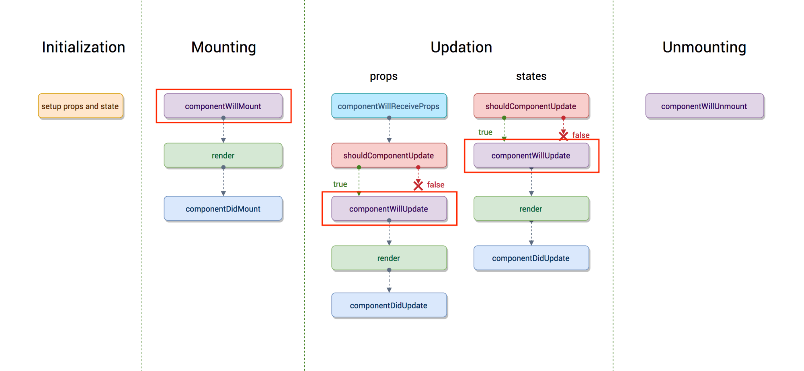
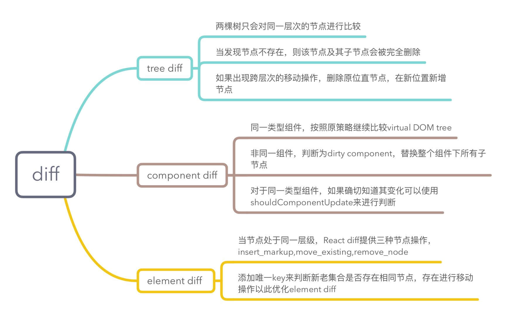
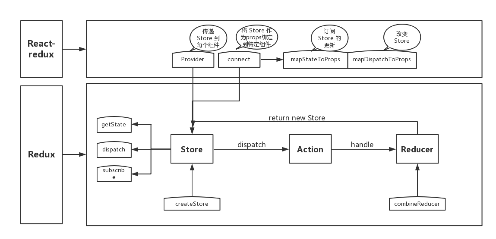

# React

## Fiber

[原文](https://juejin.im/post/5c92f499f265da612647b754)

产生原因：

随着应用变得越来越庞大，整个更新渲染的过程开始变得吃力，大量的组件渲染会导致主进程长时间被占用，
导致一些动画或高频操作出现卡顿和掉帧的情况。而关键点，便是`同步阻塞`。
在之前的`reconcilation`调度算法中，React 需要实例化每个类组件，生成一颗组件树，使用`同步递归`的方式进行遍历渲染，而这个过程最大的问题就是无法`暂停和恢复`

解决方法：

解决同步阻塞的方法，通常有两种: `异步`与`任务分割`。而 React Fiber 便是为了实现任务分割而诞生的

简述：

- 在 React V16 将调度算法进行了重构， 将之前的 stack reconciler 重构成新版的 fiber reconciler，变成了具有链表和指针的`单链表树遍历算法`。通过指针映射，每个单元都记录着遍历当下的上一步与下一步，从而使遍历变得可以被暂停和重启
- 这里我理解为是一种`任务分割调度算法`，主要是 将原先同步更新渲染的任务分割成一个个独立的`小任务单位`，根据不同的优先级，将小任务分散到浏览器的空闲时间执行，充分利用主进程的事件循环机制

核心：

```js
class Fiber {
  constructor(instance) {
    this.instance = instance
    // 指向第一个 child 节点
    this.child = child
    // 指向父节点
    this.return = parent
    // 指向第一个兄弟节点
    this.sibling = previous
  }
}
```

- **链表树遍历算法**: 通过`节点保存与映射`，便能够随时地进行 停止和重启，这样便能达到实现任务分割的基本前提

  1. 首先通过不断遍历子节点，到树末尾
  2. 开始通过 sibling 遍历兄弟节点
  3. return 返回父节点，继续执行2
  4. 直到 root 节点后，跳出遍历

- **任务分割**，React 中的渲染更新可以分成两个阶段:

  - **reconciliation**阶段: vdom 的数据对比，是个适合拆分的阶段，比如对比一部分树后，先暂停执行个动画调用，待完成后再回来继续比对
  - **Commit**阶段: 将 change list 更新到 dom 上，并不适合拆分，才能保持数据与 UI 的同步。否则可能由于阻塞 UI 更新，
  而导致数据更新和 UI 不一致的情况

- **分散执行**: 任务分割后，就可以把小任务单元分散到浏览器的空闲期间去排队执行，
  而实现的关键是两个新API: `requestIdleCallback`与 `requestAnimationFrame`

  - 低优先级的任务交给`requestIdleCallback`处理，这是个浏览器提供的事件循环空闲期的回调函数，需要 pollyfill，
  而且拥有 deadline 参数，限制执行事件，以继续切分任务

  - 高优先级的任务交给`requestAnimationFrame`处理

    ```js
    // 类似于这样的方式
    requestIdleCallback((deadline) => {
        // 当有空闲时间时，我们执行一个组件渲染；
        // 把任务塞到一个个碎片时间中去；
        while ((deadline.timeRemaining() > 0 || deadline.didTimeout)
          && nextComponent) {
            nextComponent = performWork(nextComponent);
        }
    });
    ```

- **优先级策略**:文本框输入 > 本次调度结束需完成的任务 > 动画过渡 > 交互反馈 > 数据更新 > 不会显示但以防将来会显示的任务

## 生命周期

v16.3版本之前的生命周期




在v16.3中，React对生命周期有了新的`变动建议`


- 使用`getDerivedStateFromProps`替换`componentWillMount`
- 使用`getSnapshotBeforeUpdate`替换`componentWillUpdate`
- 避免使用`componentWillReceiveProps`

在v16.4中，修正了getDerivedStateFromProps


其实该变动的原因，正是由于上述提到的 Fiber。首先，从上面我们知道 React 可以分成 reconciliation 与 commit 两个阶段，对应的生命周期如下:

- reconciliation
  - componentWillMount
  - componentWillReceiveProps
  - shouldComponentUpdate
  - componentWillUpdate

- commit
  - componentDidMount
  - componentDidUpdate
  - componentWillUnmount

在 Fiber 中，reconciliation 阶段进行了任务分割，涉及到 暂停 和 重启，因此可能会导致 reconciliation 中的生命周期函数在一次更新渲染循环中被`多次调用`的情况，产生一些意外错误

新的生命周期如下：

```js
class Component extends React.Component {
  // 替换 `componentWillReceiveProps` ，
  // 初始化和 update 时被调用
  // 静态函数，无法使用 this
  static getDerivedStateFromProps(nextProps, prevState) {}
  
  // 判断是否需要更新组件
  // 可以用于组件性能优化
  shouldComponentUpdate(nextProps, nextState) {}
  
  // 组件被挂载后触发
  componentDidMount() {}
  
  // 替换 componentWillUpdate
  // 可以在更新之前获取最新 dom 数据
  getSnapshotBeforeUpdate() {}
  
  // 组件更新后调用
  componentDidUpdate() {}
  
  // 组件即将销毁
  componentWillUnmount() {}
  
  // 组件已销毁
  componentDidUnMount() {}
}
```

### 新的生命周期用法


## setState

### 事务

在了解setState之前，我们先来简单了解下 React 一个包装结构: **Transaction**:

- **事务**：
  - 是 React 中的一个调用结构，用于包装一个方法，结构为: **initialize - perform(method) - close**。通过事务，可以统一管理一个方法的开始与结束；处于事务流中，表示进程正在执行一些操作

### setState方法

React 中用于修改状态，更新视图。它具有以下特点:

- **异步与同步**： setState并不是单纯的异步或同步，这其实与调用时的环境相关

  - 在**合成事件**和**生命周期钩子(除 componentDidUpdate)**中，setState是“异步”的

    - 原因：因为在setState的实现中，有一个判断: 当更新策略正在事务流的执行中时，该组件更新会被推入dirtyComponents队列中等待执行；否则，开始执行batchedUpdates队列更新

      - 在生命周期钩子调用中，更新策略都处于更新之前，组件仍处于事务流中，而componentDidUpdate是在更新之后，此时组件已经不在事务流中了，因此则会同步执行
      - 在合成事件中，React 是基于**事务流完成的事件委托机制**实现，也是处于事务流中

    - 问题：无法在setState后马上从this.state上获取更新后的值

    - 解决：如果需要马上同步去获取新值，setState其实是可以传入第二个参数的。setState(updater, callback)，在回调中即可获取最新值

  - 在**原生事件**和**setTimout**中，setState是同步的，可以马上获得更新后的值

    - 原因：原生事件是浏览器本身的实现，与事务流无关，自然是同步；而setTimeout是放置于定时器线程中延后执行，此时事务流已结束，因此也是同步

- **批量更新**：在**合成事件**和**生命周期钩子**中，setState更新队列时，存储的是**合并状态**(Object.assign)。
  因此前面设置的 key 值会被后面所覆盖，最终只会执行一次更新

- **函数式**：于 Fiber 及 合并 的问题，官方推荐可以传入 函数 的形式。setState(fn)，在fn中返回新的state对象即可，
  例如this.setState((state, props) => newState)

  - 使用函数式，可以用于避免setState的批量更新的逻辑，传入的函数将会被 顺序调用。

## diff



## Render Props

The Render Props是一种在不重复代码的情况下共享组件间功能的方法。

```js
<DataProvider render={data => (
  <h1>Hello {data.target}</h1>
)}/>
```

通过使用prop来定义呈现的内容，组件只是注入功能，而不需要知道它如何应用于UI。render prop 模式意味着用户通过定义单独组件来传递prop方法，来指示共享组件应该返回的内容。

Render Props 的核心思想是，通过一个函数将class组件的state作为props传递给纯函数组件

```js
import React from 'react';

const SharedComponent extends React.Component {
  state = {...}
  render() {
    return (
      <div>
        {this.props.render(this.state)}
      </div>
    );
  }
}

export default SharedComponent;
```

## mixin、hoc、render props、react-hooks的优劣如何

### Mixin的缺陷

- 组件与 Mixin 之间存在隐式依赖（Mixin 经常依赖组件的特定方法，但在定义组件时并不知道这种依赖关系）
- 多个 Mixin 之间可能产生冲突（比如定义了相同的state字段）
- Mixin 倾向于增加更多状态，这降低了应用的可预测性（The more state in your application, the harder it is to reason about it.），导致复杂度剧增
- 隐式依赖导致依赖关系不透明，维护成本和理解成本迅速攀升：
  - 难以快速理解组件行为，需要全盘了解所有依赖 Mixin 的扩展行为，及其之间的相互影响
  - 组价自身的方法和state字段不敢轻易删改，因为难以确定有没有 Mixin 依赖它
  - Mixin 也难以维护，因为 Mixin 逻辑最后会被打平合并到一起，很难搞清楚一个 Mixin 的输入输出

### HOC相比Mixin的优势

- HOC通过外层组件通过 Props 影响内层组件的状态，而不是直接改变其 State不存在冲突和互相干扰,这就降低了耦合度
- 不同于 Mixin 的打平+合并，HOC 具有天然的层级结构（组件树结构），这又降低了复杂度。

### HOC的缺陷

- 扩展性限制: HOC 无法从外部访问子组件的 State因此无法通过shouldComponentUpdate滤掉不必要的更新,React 在支持 ES6 Class 之后提供了React.PureComponent来解决这个问题
- Ref 传递问题: Ref 被隔断,后来的React.forwardRef 来解决这个问题
- Wrapper Hell: HOC可能出现多层包裹组件的情况,多层抽象同样增加了复杂度和理解成本
- 命名冲突: 如果高阶组件多次嵌套,没有使用命名空间的话会产生冲突,然后覆盖老属性
- 不可见性: HOC相当于在原有组件外层再包装一个组件,你压根不知道外层的包装是啥,对于你是黑盒

### Render Props优点

上述HOC的缺点Render Props都可以解决

### Render Props缺陷

- 使用繁琐: HOC使用只需要借助装饰器语法通常一行代码就可以进行复用,Render Props无法做到如此简单
- 嵌套过深: Render Props虽然摆脱了组件多层嵌套的问题,但是转化为了函数回调的嵌套

### React Hooks优点

- 简洁: React Hooks解决了HOC和Render Props的嵌套问题,更加简洁
- 解耦: React Hooks可以更方便地把 UI 和状态分离,做到更彻底的解耦
- 组合: Hooks 中可以引用另外的 Hooks形成新的Hooks,组合变化万千
- 函数友好: React Hooks为函数组件而生,从而解决了类组件的几大问题:
  - this 指向容易错误
  - 分割在不同声明周期中的逻辑使得代码难以理解和维护
  - 代码复用成本高（高阶组件容易使代码量剧增）

### React Hooks缺陷

- 额外的学习成本（Functional Component 与 Class Component 之间的困惑）
- 写法上有限制（不能出现在条件、循环中），并且写法限制增加了重构成本
- 破坏了PureComponent、React.memo浅比较的性能优化效果（为了取最新的props和state，每次render()都要重新创建事件处函数）
- 在闭包场景可能会引用到旧的state、props值
- 内部实现上不直观（依赖一份可变的全局状态，不再那么“纯”）
- React.memo并不能完全替代shouldComponentUpdate（因为拿不到 state change，只针对 props change）

## react-redux是如何工作的

- Provider: Provider的作用是从最外部封装了整个应用，并向connect模块传递store
- connect: 负责连接React和Redux
  - 获取state: connect通过context获取Provider中的store，通过store.getState()获取整个store tree 上所有state
  - 包装原组件: 将state和action通过props的方式传入到原组件内部wrapWithConnect返回一个ReactComponent对象Connect，Connect重新render外部传入的原组件WrappedComponent，并把connect中传入的mapStateToProps, mapDispatchToProps与组件上原有的props合并后，通过属性的方式传给WrappedComponent
  - 监听store tree变化: connect缓存了store tree中state的状态,通过当前state状态和变更前state状态进行比较,从而确定是否调用this.setState()方法触发Connect及其子组件的重新渲染



## redux异步中间件之间的优劣

### redux-thunk优点

- 体积小: redux-thunk的实现方式很简单,只有不到20行代码
- 使用简单: redux-thunk没有引入像redux-saga或redux-observable额外的范式,上手简单

### redux-thunk缺陷

- 样板代码过多: 与redux本身一样,通常一个请求需要大量的代码,而且很多都是重复性质的
- 耦合严重: 异步操作与redux的action偶合在一起,不方便管理
- 功能孱弱: 有一些实际开发中常用的功能需要自己进行封装

### redux-saga优点

- 异步解耦: 异步操作被被转移到单独 saga.js 中，不再是掺杂在 action.js 或 component.js 中
- action摆脱thunk function: dispatch 的参数依然是一个纯粹的 action (FSA)，而不是充满 “黑魔法” thunk function
- 异常处理: 受益于 generator function 的 saga 实现，代码异常/请求失败 都可以直接通过 try/catch 语法直接捕获处理
- 功能强大: redux-saga提供了大量的Saga 辅助函数和Effect 创建器供开发者使用,开发者无须封装或者简单封装即可使用
- 灵活: redux-saga可以将多个Saga可以串行/并行组合起来,形成一个非常实用的异步flow
- 易测试，提供了各种case的测试方案，包括mock task，分支覆盖等等

### redux-saga缺陷

- 额外的学习成本: redux-saga不仅在使用难以理解的 generator function,而且有数十个API,学习成本远超redux-thunk,最重要的是你的额外学习成本是只服务于这个库的,与redux-observable不同,redux-observable虽然也有额外学习成本但是背后是rxjs和一整套思想
- 体积庞大: 体积略大,代码近2000行，min版25KB左右
- 功能过剩: 实际上并发控制等功能很难用到,但是我们依然需要引入这些代码
- ts支持不友好: yield无法返回TS类型

### redux-observable优点

- 功能最强: 由于背靠rxjs这个强大的响应式编程的库,借助rxjs的操作符,你可以几乎做任何你能想到的异步处理
- 背靠rxjs: 由于有rxjs的加持,如果你已经学习了rxjs,redux-observable的学习成本并不高,而且随着rxjs的升级redux-observable也会变得更强大

### redux-observable缺陷

- 学习成本奇高: 如果你不会rxjs,则需要额外学习两个复杂的库
- 社区一般: redux-observable的下载量只有redux-saga的1/5,社区也不够活跃,在复杂异步流中间件这个层面redux-saga仍处于领导地位

## redux与mobx的区别

- redux将数据保存在单一的store中，mobx将数据保存在分散的多个store中
- redux使用plain object保存数据，需要手动处理变化后的操作；mobx适用observable保存数据，数据变化后自动处理响应的操作
- redux使用不可变状态，这意味着状态是只读的，不能直接去修改它，而是应该返回一个新的状态，同时使用纯函数；mobx中的状态是可变的，可以直接对其进行修改
- mobx相对来说比较简单，在其中有很多的抽象，mobx更多的使用面向对象的编程思维；redux会比较复杂，因为其中的函数式编程思想掌握起来不是那么容易，同时需要借助一系列的中间件来处理异步和副作用
- mobx中有更多的抽象和封装，调试会比较困难，同时结果也难以预测；而redux提供能够进行时间回溯的开发工具，同时其纯函数以及更少的抽象，让调试变得更加的容易
场景辨析:

基于以上区别,我们可以简单得分析一下两者的不同使用场景.

- mobx更适合数据不复杂的应用: mobx难以调试,很多状态无法回溯,面对复杂度高的应用时,往往力不从心.
- redux适合有回溯需求的应用: 比如一个画板应用、一个表格应用，很多时候需要撤销、重做等操作，由于redux不可变的特性，天然支持这些操作.
- mobx适合短平快的项目: mobx上手简单,样板代码少,可以很大程度上提高开发效率.
- 当然mobx和redux也并不一定是非此即彼的关系,你也可以在项目中用redux作为全局状态管理,用mobx作为组件局部状态管理器来

## 为什么需要Virtual DOM

首先,我们都知道在前端性能优化的一个秘诀就是尽可能少地操作DOM,不仅仅是DOM相对较慢,更因为**频繁变动DOM会造成浏览器的回流或者重绘,这些都是性能的杀手,因此我们需要这一层抽象,在patch过程中尽可能地一次性将差异更新到DOM中**,这样保证了DOM不会出现性能很差的情况.

其次,现代前端框架的一个基本要求就是无须手动操作DOM,一方面是因为**手动操作DOM无法保证程序性能**,多人协作的项目中如果review不严格,可能会有开发者写出性能较低的代码,另一方面更重要的是**省略手动DOM操作可以大大提高开发效率**.

最后,也是Virtual DOM最初的目的,就是更好的**跨平台**,比如Node.js就没有DOM,如果想实现SSR(服务端渲染),那么一个方式就是借助Virtual DOM,因为Virtual DOM本身是JavaScript对象
