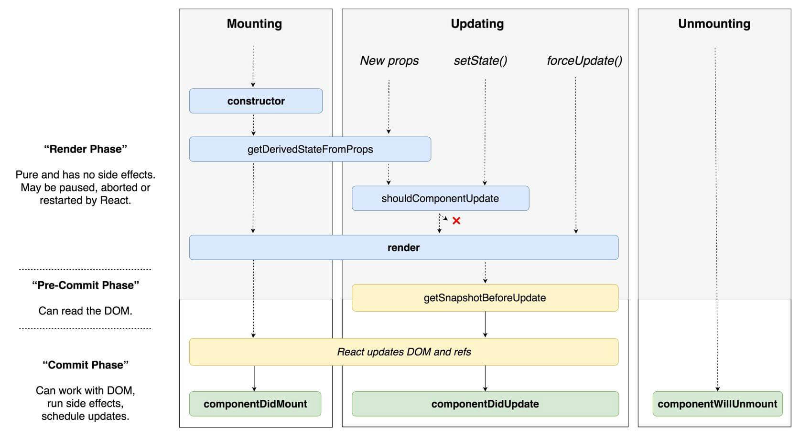
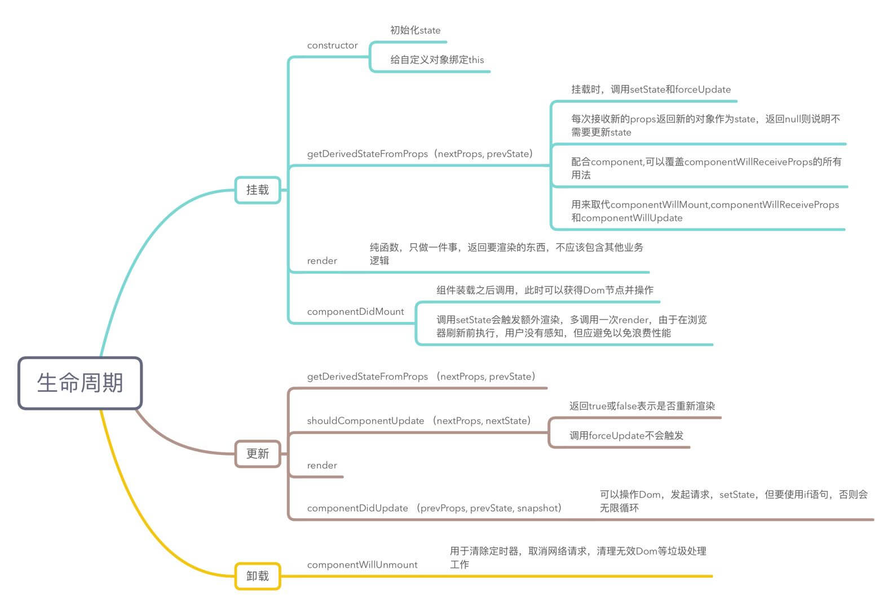

# React

## Fiber

[原文](https://juejin.im/post/5c92f499f265da612647b754)

产生原因：

随着应用变得越来越庞大，整个更新渲染的过程开始变得吃力，大量的组件渲染会导致主进程长时间被占用，
导致一些动画或高频操作出现卡顿和掉帧的情况。而关键点，便是`同步阻塞`。
在之前的调度算法中，React 需要实例化每个类组件，生成一颗组件树，使用`同步递归`的方式进行遍历渲染，而这个过程最大的问题就是无法`暂停和恢复`

解决方法：

解决同步阻塞的方法，通常有两种: `异步`与`任务分割`。而 React Fiber 便是为了实现任务分割而诞生的

简述：

- 在 React V16 将调度算法进行了重构， 将之前的 stack reconciler 重构成新版的 fiber reconciler，变成了具有链表和指针的`单链表树遍历算法`。通过指针映射，每个单元都记录着遍历当下的上一步与下一步，从而使遍历变得可以被暂停和重启
- 这里我理解为是一种`任务分割调度算法`，主要是 将原先同步更新渲染的任务分割成一个个独立的`小任务单位`，根据不同的优先级，将小任务分散到浏览器的空闲时间执行，充分利用主进程的事件循环机制

核心：

```js
class Fiber {
  constructor(instance) {
    this.instance = instance
    // 指向第一个 child 节点
    this.child = child
    // 指向父节点
    this.return = parent
    // 指向第一个兄弟节点
    this.sibling = previous
  }
}
```

- **链表树遍历算法**: 通过`节点保存与映射`，便能够随时地进行 停止和重启，这样便能达到实现任务分割的基本前提

  1. 首先通过不断遍历子节点，到树末尾
  2. 开始通过 sibling 遍历兄弟节点
  3. return 返回父节点，继续执行2
  4. 直到 root 节点后，跳出遍历

- **任务分割**，React 中的渲染更新可以分成两个阶段:

  - **reconciliation**阶段: vdom 的数据对比，是个适合拆分的阶段，比如对比一部分树后，先暂停执行个动画调用，待完成后再回来继续比对
  - **Commit**阶段: 将 change list 更新到 dom 上，并不适合拆分，才能保持数据与 UI 的同步。否则可能由于阻塞 UI 更新，
  而导致数据更新和 UI 不一致的情况

- **分散执行**: 任务分割后，就可以把小任务单元分散到浏览器的空闲期间去排队执行，
  而实现的关键是两个新API: `requestIdleCallback`与 `requestAnimationFrame`

  - 低优先级的任务交给`requestIdleCallback`处理，这是个浏览器提供的事件循环空闲期的回调函数，需要 pollyfill，
  而且拥有 deadline 参数，限制执行事件，以继续切分任务

  - 高优先级的任务交给`requestAnimationFrame`处理

    ```js
    // 类似于这样的方式
    requestIdleCallback((deadline) => {
        // 当有空闲时间时，我们执行一个组件渲染；
        // 把任务塞到一个个碎片时间中去；
        while ((deadline.timeRemaining() > 0 || deadline.didTimeout)
          && nextComponent) {
            nextComponent = performWork(nextComponent);
        }
    });
    ```

- **优先级策略**:文本框输入 > 本次调度结束需完成的任务 > 动画过渡 > 交互反馈 > 数据更新 > 不会显示但以防将来会显示的任务

## 生命周期

v16.3版本之前的生命周期


在v16.3中，React对生命周期有了新的`变动建议`



- 使用`getDerivedStateFromProps`替换`componentWillMount`
- 使用`getSnapshotBeforeUpdate`替换`componentWillUpdate`
- 避免使用`componentWillReceiveProps`

其实该变动的原因，正是由于上述提到的 Fiber。首先，从上面我们知道 React 可以分成 reconciliation 与 commit 两个阶段，对应的生命周期如下:

- reconciliation
  - componentWillMount
  - componentWillReceiveProps
  - shouldComponentUpdate
  - componentWillUpdate

- commit
  - componentDidMount
  - componentDidUpdate
  - componentWillUnmount

在 Fiber 中，reconciliation 阶段进行了任务分割，涉及到 暂停 和 重启，因此可能会导致 reconciliation 中的生命周期函数在一次更新渲染循环中被`多次调用`的情况，产生一些意外错误

新的生命周期如下：

```js
class Component extends React.Component {
  // 替换 `componentWillReceiveProps` ，
  // 初始化和 update 时被调用
  // 静态函数，无法使用 this
  static getDerivedStateFromProps(nextProps, prevState) {}
  
  // 判断是否需要更新组件
  // 可以用于组件性能优化
  shouldComponentUpdate(nextProps, nextState) {}
  
  // 组件被挂载后触发
  componentDidMount() {}
  
  // 替换 componentWillUpdate
  // 可以在更新之前获取最新 dom 数据
  getSnapshotBeforeUpdate() {}
  
  // 组件更新后调用
  componentDidUpdate() {}
  
  // 组件即将销毁
  componentWillUnmount() {}
  
  // 组件已销毁
  componentDidUnMount() {}
}
```

### 新的生命周期用法



## setState

### 事务

在了解setState之前，我们先来简单了解下 React 一个包装结构: **Transaction**:

- **事务**：
  - 是 React 中的一个调用结构，用于包装一个方法，结构为: **initialize - perform(method) - close**。通过事务，可以统一管理一个方法的开始与结束；处于事务流中，表示进程正在执行一些操作

### setState方法

React 中用于修改状态，更新视图。它具有以下特点:

- **异步与同步**： setState并不是单纯的异步或同步，这其实与调用时的环境相关

  - 在**合成事件**和**生命周期钩子(除 componentDidUpdate)**中，setState是“异步”的

    - 原因：因为在setState的实现中，有一个判断: 当更新策略正在事务流的执行中时，该组件更新会被推入dirtyComponents队列中等待执行；否则，开始执行batchedUpdates队列更新

      - 在生命周期钩子调用中，更新策略都处于更新之前，组件仍处于事务流中，而componentDidUpdate是在更新之后，此时组件已经不在事务流中了，因此则会同步执行
      - 在合成事件中，React 是基于**事务流完成的事件委托机制**实现，也是处于事务流中

    - 问题：无法在setState后马上从this.state上获取更新后的值

    - 解决：如果需要马上同步去获取新值，setState其实是可以传入第二个参数的。setState(updater, callback)，在回调中即可获取最新值

  - 在**原生事件**和**setTimout**中，setState是同步的，可以马上获得更新后的值

    - 原因：原生事件是浏览器本身的实现，与事务流无关，自然是同步；而setTimeout是放置于定时器线程中延后执行，此时事务流已结束，因此也是同步

- **批量更新**：在**合成事件**和**生命周期钩子**中，setState更新队列时，存储的是**合并状态**(Object.assign)。
  因此前面设置的 key 值会被后面所覆盖，最终只会执行一次更新

- **函数式**：于 Fiber 及 合并 的问题，官方推荐可以传入 函数 的形式。setState(fn)，在fn中返回新的state对象即可，
  例如this.setState((state, props) => newState)

  - 使用函数式，可以用于避免setState的批量更新的逻辑，传入的函数将会被 顺序调用。

## diff


