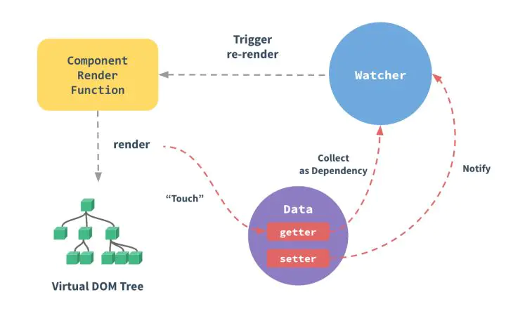

# Vue

## Vue依赖收集



每个组件实例都有相应的 Watcher 实例对象，它会在组件渲染的过程中把属性记录为依赖，之后当依赖项的 setter 被调用时，会通知 watcher 重新计算，从而致使它关联的组件得以更新。

- Observe 类主要给响应式对象的属性添加 getter/setter 用于依赖收集与派发更新
- Dep 类用于收集当前响应式对象的依赖关系
- Watcher 类是观察者，实例分为渲染 watcher(render)、计算属性 watcher(computed)、侦听器 watcher(watch)三种


### Observe

Vue中用Observer类来管理上述响应式化Object.defineProperty的过程

这个方法主要用 data 作为参数去实例化一个 Observer 对象实例，Observer 是一个 Class，用于依赖收集和 notify 更新，Observer 的构造函数使用 defineReactive 方法给对象的键响应式化，给对象的属性递归添加 getter/setter ，当data被取值的时候触发 getter 并搜集依赖，当被修改值的时候先触发 getter 再触发 setter 并派发更新

```js
class Observer {
    constructor() {
      // 响应式绑定数据通过方法
      observe(this.data);
    }
}

export function observe (data) {
    const keys = Object.keys(data);
    for (let i = 0; i < keys.length; i++) {
       // 将data中我们定义的每个属性进行响应式绑定
       defineReactive(obj, keys[i]);
    }
}
```

defineReactive

```js
export function defineReactive ( obj: Object, key: string, val: any, customSetter?: ?Function, shallow?: boolean) {
  const dep = new Dep()         // 在每个响应式键值的闭包中定义一个dep对象

  // 如果之前该对象已经预设了getter/setter则将其缓存，新定义的getter/setter中会将其执行
  const getter = property && property.get
  const setter = property && property.set

  let childOb = !shallow && observe(val)
  Object.defineProperty(obj, key, {
    enumerable: true,
    configurable: true,
    get: function reactiveGetter () {
      const value = getter ? getter.call(obj) : val         // 如果原本对象拥有getter方法则执行
      if (Dep.target) {                    // 如果当前有watcher在读取当前值, Dep.target为全局target属性，暂存watcher
        dep.depend()                       // 那么进行依赖收集，dep.addSub
      }
      return value
    },
    set: function reactiveSetter (newVal) {
      const value = getter ? getter.call(obj) : val    // 先getter
      if (newVal === value || (newVal !== newVal && value !== value)) {   // 如果跟原来值一样则不管
        return
      }
      if (setter) { setter.call(obj, newVal) }         // 如果原本对象拥有setter方法则执行
      else { val = newVal }
      dep.notify()                                     // 如果发生变更，则通知更新，调用watcher.update()
    }
  })
}
```

### Dep

```js
let uid = 0;
class Dep {
    static target = null;  // 巧妙的设计！
    constructor() {
        this.id = uid++;
        this.subs = [];
    }
    addSub(sub) {
        this.subs.push(sub);
    }
    removeSub(sub) {
        this.subs.$remove(sub);
    }
    depend() {
        Dep.target.addDep(this);
    }
    notify() {
        const subs = this.subs.slice();
        for (let i = 0, l = subs.length; i < l; i++) {
            subs[i].update();
        }
    }
}
```

由于JavaScript是单线程模型，所以虽然有多个观察者函数，但是一个时刻内，就只会有一个观察者函数在执行，那么此刻正在执行的那个观察者函数，所对应的Watcher实例，便会被赋给Dep.target这一类变量，从而只要访问Dep.target就能知道当前的观察者是谁。 在后续的依赖收集工作里，getter里会调用dep.depend()，而setter里则会调用dep.notify()

### Watcher

Watcher订阅者作为Observer和Compile之间通信的桥梁，主要做的事情是:
1、在自身实例化时往属性订阅器(dep)里面添加自己
2、自身必须有一个update()方法
3、待属性变动dep.notice()通知时，能调用自身的update()方法，并触发Compile中绑定的回调，则功成身退。

```js
class Watcher {
  constrcutor(vm, exp, cb) {
    this.cb = cb;
    this.vm = vm;
    this.exp = exp;
    // 此处为了触发属性的getter，从而在dep添加自己，结合Observer更易理解
    this.value = this.get();
  }
}
Watcher.prototype = {
    update: function() {
        this.run();    // 属性值变化收到通知
    },
    run: function() {
        var value = this.get(); // 取到最新值
        var oldVal = this.value;
        if (value !== oldVal) {
            this.value = value;
            this.cb.call(this.vm, value, oldVal); // 执行Compile中绑定的回调，更新视图
        }
    },
    get: function() {
        Dep.target = this;    // 将当前订阅者指向自己
        var value = this.vm[exp];    // 触发getter，添加自己到属性订阅器中
        Dep.target = null;    // 添加完毕，重置
        return value;
    }
};
// 这里再次列出Observer和Dep，方便理解
Object.defineProperty(data, key, {
    get: function() {
        // 由于需要在闭包内添加watcher，所以可以在Dep定义一个全局target属性，暂存watcher, 添加完移除
        Dep.target && dep.addDep(Dep.target);
        return val;
    }
    // ... 省略
});
Dep.prototype = {
    notify: function() {
        this.subs.forEach(function(sub) {
            sub.update(); // 调用订阅者的update方法，通知变化
        });
    }
};
```

### initState顺序

```js
// vue/src/core/instance/state.js
export function initState (vm: Component) {
  vm._watchers = []
  const opts = vm.$options
  if (opts.props) initProps(vm, opts.props)
  if (opts.methods) initMethods(vm, opts.methods)
  if (opts.data) {
    initData(vm)
  } else {
    observe(vm._data = {}, true /* asRootData */)
  }
  if (opts.computed) initComputed(vm, opts.computed)
  if (opts.watch && opts.watch !== nativeWatch) {
    initWatch(vm, opts.watch)
  }
}
```

### 参考文献

- Vue源码阅读 - 依赖收集原理：[https://juejin.im/post/5b40c8495188251af3632dfa](https://juejin.im/post/5b40c8495188251af3632dfa)
- Vue响应式原理-理解Observer、Dep、Watcher：[https://juejin.im/post/5cf3cccee51d454fa33b1860](https://juejin.im/post/5cf3cccee51d454fa33b1860)
- Vue源码解读之Dep,Observer和Watcher：[https://segmentfault.com/a/1190000016208088](https://segmentfault.com/a/1190000016208088)

## 生命周期

### 生命周期示意图


## Vue组件通信

- props/$emit+v-on: 通过props将数据自上而下传递，而通过$emit和v-on来向上传递信息。
- EventBus: 通过EventBus进行信息的发布与订阅
- vuex: 是全局数据管理库，可以通过vuex管理全局的数据流
- $attrs/$listeners: Vue2.4中加入的$attrs/$listeners可以进行跨级的组件通信
- provide/inject：以允许一个祖先组件向其所有子孙后代注入一个依赖，不论组件层次有多深，并在起上下游关系成立的时间里始终生效，这成为了跨组件通信的基础

## Proxy与Object.defineProperty的优劣对比

Proxy的优势如下:

- Proxy可以直接监听对象而非属性
- Proxy可以直接监听数组的变化
- Proxy有多达13种拦截方法,不限于apply、ownKeys、deleteProperty、has等等是Object.defineProperty不具备的
- Proxy返回的是一个新对象,我们可以只操作新的对象达到目的,而Object.defineProperty只能遍历对象属性直接修改
- Proxy作为新标准将受到浏览器厂商重点持续的性能优化，也就是传说中的新标准的性能红利

Object.defineProperty的优势如下:

- 兼容性好,支持IE9

## 既然Vue通过数据劫持可以精准探测数据变化,为什么还需要虚拟DOM进行diff检测差异

现代前端框架有两种方式侦测变化,一种是pull一种是push

pull: 其代表为React,我们可以回忆一下React是如何侦测到变化的,我们通常会用setStateAPI显式更新,然后React会进行一层层的Virtual Dom Diff操作找出差异,然后Patch到DOM上,React从一开始就不知道到底是哪发生了变化,只是知道「有变化了」,然后再进行比较暴力的Diff操作查找「哪发生变化了」，另外一个代表就是Angular的脏检查操作。

push: Vue的响应式系统则是push的代表,当Vue程序初始化的时候就会对数据data进行依赖的收集,一但数据发生变化,响应式系统就会立刻得知,因此Vue是一开始就知道是「在哪发生变化了」,但是这又会产生一个问题,如果你熟悉Vue的响应式系统就知道,通常一个绑定一个数据就需要一个Watcher,一但我们的绑定细粒度过高就会产生大量的Watcher,这会带来内存以及依赖追踪的开销,而细粒度过低会无法精准侦测变化,因此Vue的设计是选择中等细粒度的方案,在组件级别进行push侦测的方式,也就是那套响应式系统,通常我们会第一时间侦测到发生变化的组件,然后在组件内部进行Virtual Dom Diff获取更加具体的差异,而Virtual Dom Diff则是pull操作,Vue是push+pull结合的方式进行变化侦测的。

### 参考文献

- 既然Vue通过数据劫持可以精准探测数据变化,为什么还需要虚拟DOM进行diff检测差异：[https://www.cxymsg.com/guide/vue.html#vue%E4%B8%BA%E4%BB%80%E4%B9%88%E6%B2%A1%E6%9C%89%E7%B1%BB%E4%BC%BC%E4%BA%8Ereact%E4%B8%ADshouldcomponentupdate%E7%9A%84%E7%94%9F%E5%91%BD%E5%91%A8%E6%9C%9F%EF%BC%9F](https://www.cxymsg.com/guide/vue.html#vue%E4%B8%BA%E4%BB%80%E4%B9%88%E6%B2%A1%E6%9C%89%E7%B1%BB%E4%BC%BC%E4%BA%8Ereact%E4%B8%ADshouldcomponentupdate%E7%9A%84%E7%94%9F%E5%91%BD%E5%91%A8%E6%9C%9F%EF%BC%9F)

## Vue为什么没有类似于React中shouldComponentUpdate的生命周期

React是pull的方式侦测变化,当React知道发生变化后,会使用Virtual Dom Diff进行差异检测,但是很多组件实际上是肯定不会发生变化的,这个时候需要用shouldComponentUpdate进行手动操作来减少diff,从而提高程序整体的性能.

Vue是pull+push的方式侦测变化的,在一开始就知道那个组件发生了变化,因此在push的阶段并不需要手动控制diff,而组件内部采用的diff方式实际上是可以引入类似于shouldComponentUpdate相关生命周期的,但是通常合理大小的组件不会有过量的diff,手动优化的价值有限,因此目前Vue并没有考虑引入shouldComponentUpdate这种手动优化的生命周期。

### 参考文献

- Vue为什么没有类似于React中shouldComponentUpdate的生命周期：[https://www.cxymsg.com/guide/vue.html#vue%E4%B8%BA%E4%BB%80%E4%B9%88%E6%B2%A1%E6%9C%89%E7%B1%BB%E4%BC%BC%E4%BA%8Ereact%E4%B8%ADshouldcomponentupdate%E7%9A%84%E7%94%9F%E5%91%BD%E5%91%A8%E6%9C%9F%EF%BC%9F](https://www.cxymsg.com/guide/vue.html#vue%E4%B8%BA%E4%BB%80%E4%B9%88%E6%B2%A1%E6%9C%89%E7%B1%BB%E4%BC%BC%E4%BA%8Ereact%E4%B8%ADshouldcomponentupdate%E7%9A%84%E7%94%9F%E5%91%BD%E5%91%A8%E6%9C%9F%EF%BC%9F)

## Vue中的key到底有什么用

key是为Vue中的vnode标记的唯一id,通过这个key,我们的diff操作可以更准确、更快速

diff算法的过程中,先会进行新旧节点的首尾交叉对比,当无法匹配的时候会用新节点的key与旧节点进行比对,然后超出差异.

> diff程可以概括为：oldCh和newCh各有两个头尾的变量StartIdx和EndIdx，它们的2个变量相互比较，一共有4种比较方式。如果4种比较都没匹配，如果设置了key，就会用key进行比较，在比较的过程中，变量会往中间靠，一旦StartIdx>EndIdx表明oldCh和newCh至少有一个已经遍历完了，就会结束比较,这四种比较方式就是首、尾、旧尾新头、旧头新尾.

- 准确: 如果不加key,那么vue会选择复用节点(Vue的就地更新策略),导致之前节点的状态被保留下来,会产生一系列的bug.
- 快速: key的唯一性可以被Map数据结构充分利用,相比于遍历查找的时间复杂度O(n),Map的时间复杂度仅仅为O(1)。

### 参考文献

- Vue中的key到底有什么用：[https://www.cxymsg.com/guide/vue.html#vue%E4%B8%AD%E7%9A%84key%E5%88%B0%E5%BA%95%E6%9C%89%E4%BB%80%E4%B9%88%E7%94%A8%EF%BC%9F](https://www.cxymsg.com/guide/vue.html#vue%E4%B8%AD%E7%9A%84key%E5%88%B0%E5%BA%95%E6%9C%89%E4%BB%80%E4%B9%88%E7%94%A8%EF%BC%9F)