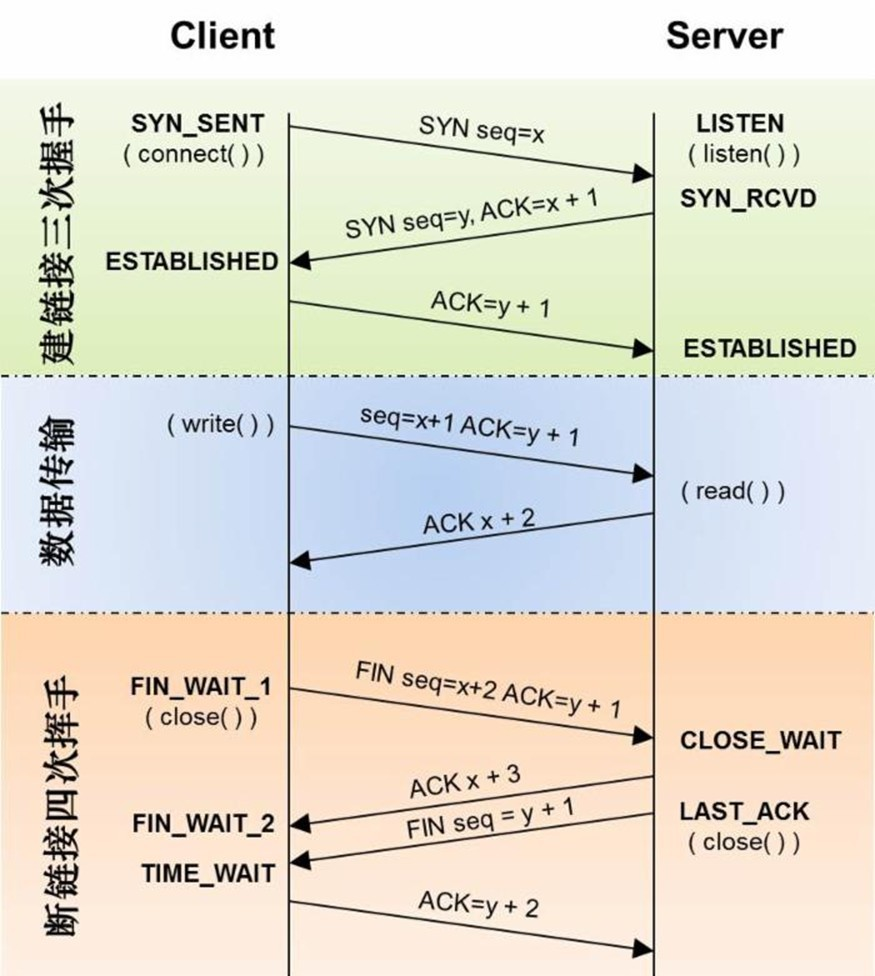

# 网络

## DNS域名解析

[原文](https://www.zhihu.com/question/23042131/answer/24922954)

- 浏览器缓存

    当用户通过浏览器访问某域名时，浏览器首先会在自己的缓存中查找是否有该域名对应的IP地址（若曾经访问过该域名且没有清空缓存便存在）

- 系统缓存

    当浏览器缓存中无域名对应IP则会自动检查用户计算机系统Hosts文件DNS缓存是否有该域名对应IP

- 路由器缓存

    当浏览器及系统缓存中均无域名对应IP则进入路由器缓存中检查，以上三步均为客服端的DNS缓存

- ISP（互联网服务提供商）DNS缓存

    当在用户客服端查找不到域名对应IP地址，则将进入ISP DNS缓存中进行查    询。比如你用的是电信的网络，则会进入电信的DNS缓存服务器中进行查找；
- 根域名服务器

    当以上均未完成，则进入根服务器进行查询。全球仅有13台根域名服务器，1个主根域名服务器，其余12为辅根域名服务器。根域名收到请求后会查看区域文件记录，若无则将其管辖范围内顶级域名（如.com）服务器IP告诉本地DNS服务器；

- 顶级域名服务器

    顶级域名服务器收到请求后查看区域文件记录，若无则将其管辖范围内主域名服务器的IP地址告诉本地DNS服务器；
　　
- 主域名服务器

    主域名服务器接受到请求后查询自己的缓存，如果没有则进入下一级域名服务器进行查找，并重复该步骤直至找到正确纪录；

- 保存结果至缓存

    本地域名服务器把返回的结果保存到缓存，以备下一次使用，同时将该结果反馈给客户端，客户端通过这个IP地址与web服务器建立链接

## TCP建立连接为何是三次握手

[原文](https://www.zhihu.com/question/24853633/answer/63668444)

在谢希仁著《计算机网络》第四版中讲“三次握手”的目的是“为了防止已失效的连接请求报文段突然又传送到了服务端，因而产生错误”。

在另一部经典的《计算机网络》一书中讲“三次握手”的目的是为了解决“网络中存在延迟的重复分组”的问题。

这两种不用的表述其实阐明的是同一个问题。

谢希仁版《计算机网络》中的例子是这样的，“已失效的连接请求报文段”的产生在这样一种情况下：client发出的第一个连接请求报文段并没有丢失，而是在某个网络结点长时间的滞留了，以致延误到连接释放以后的某个时间才到达server。
本来这是一个早已失效的报文段。但server收到此失效的连接请求报文段后，就误认为是client再次发出的一个新的连接请求。
于是就向client发出确认报文段，同意建立连接。假设不采用“三次握手”，那么只要server发出确认，新的连接就建立了。
由于现在client并没有发出建立连接的请求，因此不会理睬server的确认，也不会向server发送数据。
但server却以为新的运输连接已经建立，并一直等待client发来数据。
这样，server的很多资源就白白浪费掉了。
采用“三次握手”的办法可以防止上述现象发生。
例如刚才那种情况，client不会向server的确认发出确认。
server由于收不到确认，就知道client并没有要求建立连接。

## GET与POST的区别

1. get重点在从服务器上获取资源，post重点在向服务器发送数据
2. get传输数据是通过URL请求，以field（字段）= value的形式，置于URL后，并用'?'连接，多个请求数据间用'&'连接，这个过程用户是可见的；post传输数据通过将字段与对应值存在请求实体中发送给服务器，这个过程对用户是不可见的
3. get传输的数据量小，因为受URL长度限制，但效率较高，post可以传输大量数据，所以上传文件时只能用post方法
4. get是不安全的，因为post是可见的，可能会泄露私密信息，密码等；post安全性较高
5. get方法只支持ASCII字符，向服务器传的中文字符可能会乱码；post支持标准字符集，可以传递中文字符

## 浏览器缓存

[原文](https://www.cnblogs.com/lyzg/p/5125934.html?from=cnblogs)

1. 浏览器在加载资源时，先根据这个资源的一些http header判断它是否命中强缓存，强缓存如果命中，浏览器直接从自己的缓存中读取资源，不会发请求到服务器。比如某个css文件，如果浏览器在加载它所在的网页时，这个css文件的缓存配置命中了强缓存，浏览器就直接从缓存中加载这个css，连请求都不会发送到网页所在服务器；
2. 当强缓存没有命中的时候，浏览器一定会发送一个请求到服务器，通过服务器端依据资源的另外一些http header验证这个资源是否命中协商缓存，如果协商缓存命中，服务器会将这个请求返回，但是不会返回这个资源的数据，而是告诉客户端可以直接从缓存中加载这个资源，于是浏览器就又会从自己的缓存中去加载这个资源；
3. 强缓存与协商缓存的共同点是：如果命中，都是从客户端缓存中加载资源，而不是从服务器加载资源数据；区别是：强缓存不发请求到服务器，协商缓存会发请求到服务器。
4. 当协商缓存也没有命中的时候，浏览器直接从服务器加载资源数据。

### 强缓存

### Expires

`Expires`是较老的强缓存管理header，是http1.0提出的一个表示资源过期时间的header，由于它是服务器返回的一个绝对时间，在服务器时间与客户端时间相差较大时，缓存管理容易出现问题，比如随意修改下客户端时间，就能影响缓存命中的结果

### Cache-Control

所以在http1.1的时候，提出了一个新的header，就是`Cache-Control`，这是一个相对时间，在配置缓存的时候，以秒为单位，用数值表示，如：`Cache-Control:max-age=315360000`

`Cache-Control`描述的是一个相对时间，在进行缓存命中的时候，都是利用客户端时间进行判断，所以相比较`Expires`，`Cache-Control`的缓存管理更有效，安全一些。

这两个header可以只启用一个，也可以同时启用，当response header中，`Expires`和`Cache-Control`同时存在时，`Cache-Control`优先级高于`Expires`

### 协商缓存

当浏览器对某个资源的请求没有命中强缓存，就会发一个请求到服务器，验证协商缓存是否命中，如果协商缓存命中，
请求响应返回的http状态为304并且会显示一个`Not Modified`的字符串

协商缓存是利用的是`Last-Modified`，`If-Modified-Since`和`ETag`、`If-None-Match`这两对Header来管理的

|client|server|
|---|---|
|`If-None-Match`表示资源上一次返回的`Etag`|`Etag`根据资源生成的唯一标识|
|`If-Modified`表示资源上一次返回的`LastModified`|`LastModified`资源最后修改时间|

### 刷新

- `f5`跳过强缓存，但是会检查协商缓存
- `ctrl + f5`直接从服务器加载，跳过强缓存和协商缓存

## HTTP/2

### 1. 二进制分帧

- HTTP/2性能提升的核心就在于二进制分帧层。HTTP/2是二进制协议，他采用二进制格式传输数据而不是1.x的文本格式。
- HTTP/2中，同域名下所有通信都在单个连接上完成。
- 单个连接可以承载任何数量的双向数据流。
- 每个数据流都已消息的形式发送，而消息又由一个或多个帧组成，多个帧之间可以乱序发送，根据帧首部的流标识可以重新组装。

### 2. HTTP/2对头部进行压缩

- 在客户端与服务端使用“首部表”来跟踪和存储之前发送的键值对，对于相同的数据，不再通过每次请求和响应发送。
- 首部表再HTTP/2的连续存续期内始终存在，由客户端和服务器共同渐进地更新。
- 每个新的首部键值对要么被追加到当前表的末尾，要么替换表中之前的值。

### 3. HTTP/2多路复用解决HTTP/1.x的线头阻塞和多个TCP连接的问题

之所以速度能有如此优化，主要得益于HTTP2.0的多路复用技术。

有了新的分帧机制后，HTTP/2不再依赖多个TCP 连接去处理更多并发的请求，每个数据流都拆分成很多互不依赖的帧，而这些帧可以交错（乱序发送），还可以分优先级。最后再在另一端根据每个帧首部的流标识符把它们重新组合起来。从始至终，客户端与服务器之间只需要一个连接(同个域名下)即可

### 4. 数据流

因为 HTTP/2 的数据包是不按顺序发送的，同一个连接里面连续的数据包，可能属于不同的回应。因此，必须要对数据包做标记，指出它属于哪个回应。

HTTP/2 将每个请求或回应的所有数据包，称为一个数据流（stream）。每个数据流都有一个独一无二的编号。数据包发送的时候，都必须标记数据流ID，用来区分它属于哪个数据流。另外还规定，客户端发出的数据流，ID一律为奇数，服务器发出的，ID为偶数。

数据流发送到一半的时候，客户端和服务器都可以发送信号（RST_STREAM帧），取消这个数据流。1.1版取消数据流的唯一方法，就是关闭TCP连接。
这就是说，HTTP/2 可以取消某一次请求，同时保证TCP连接还打开着，可以被其他请求使用。
客户端还可以指定数据流的优先级。优先级越高，服务器就会越早回应。

### 5. 服务器推送

HTTP/2 允许服务器未经请求，主动向客户端发送资源，这叫做服务器推送（server push）。常见场景是客户端请求一个网页，这个网页里面包含很多静态资源。服务端能在客户端请求静态资源前主动把这些静态资源随着网页一起发给客户端了，省去了客户端建立连接、发起请求等过程，极大提升了速度

### 存在的问题

在HTTP/2中，多个请求时跑在同一个TCP管道当中。但当出现了丢包时，HTTP/2整个TCP都要开始等待重传，那么会阻塞该TCP连接中的所有请求。而对于HTTP/1.1来说，可以开启多个TCP连接，出现这种i情况反倒只回影响其中一个连接，剩余的TCP连接还可以正常传输数据
