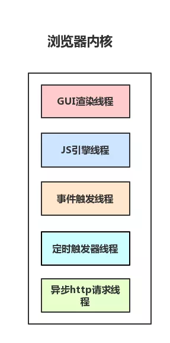

# 浏览器

## 浏览器内核

### GUI渲染线程

- 负责渲染浏览器界面，解析HTML、CSS，构建DOM树、CSSOM树和RenderObject树，布局和绘制等
- 当界面需要重绘（Repaint）或由于某种操作引发（reflow）时，该线程就会执行
- 注意，**GUI渲染线程与JS引擎线程是互斥的**，当JS引擎执行时GUI线程会被挂起（相当于被冻结了），GUI更会会保存在一个队列中**等到JS引擎空闲时**立即被执行

### JS引擎线程

- 也称未JS内核，负责处理Javascript脚本程序（例如V8引擎）
- JS引擎线程负责解析Javascript脚本，运行代码
- JS引擎一直等待着任务队列中任务的到来，然后加以处理，一个Tab页中无论什么时候都只有一个JS线程在运行程序
- 同样注意，**GUI渲染线程和JS引擎线程是互斥的**，所以如果JS执行的时间过长，这样就会造成页面的渲染不连贯，导致页面渲染加载阻塞

### 事件触发线程

- 归属于浏览器而不是JS引擎，用来控制事件循环，**管理任务队列**
- 当JS引擎执行代码块入如setTimeout，鼠标点击，AJAX异步请求时，会将对应任务添加到事件线程中
- 当对应的事件符合触发条件被触发时，该线程会把事件添加到待处理队列的队尾，等待JS引擎的处理
- 注意，由于JS的单线程关系，所以这些待处理队列中的事件都得排队等待JS引擎处理（当JS引擎空闲时才会去执行）

### 定时器触发线程

- 传说中的setInterval与setTimout所在的线程
- 浏览器定时计数器并不是有JavaScript引擎计数的（因为JavaScript引擎是单线程的，如果处于阻塞线程状态就会影响计时的准确）
- 因此通过单独线程来计时并触发定时（计时完毕后，添加到任务队列中，等待JS引擎空闲后执行）
- 注意，W3C在HTML标准中规定，规定要求setTimout中低于4ms的时间间隔算为4ms

### 异步http请求线程

- 在XMLHttpRequest在连接后是通过浏览器新开一个线程请求
- 将检测到状态变更时，如果设置有回调函数，异步线程就产生状态变更事件，将这个回调再放入待处理队列中，再由JavaScript引擎执行

## load事件与DOMContentLoaded事件的先后

- 当 DOMContentLoaded 事件触发时，仅当DOM加载完成，不包括样式表，图片。
(譬如如果有async加载的脚本就不一定完成)
- 当 onload 事件触发时，页面上所有的DOM，样式表，脚本，图片都已经加载完成了。（渲染完毕了）

顺序是：DOMContentLoaded -> load

DOMContentLoaded的其他情况：

1. 如果页面中同时存在css和js，并且存在js在css后面，则DOMContentLoaded事件会在css加载完后才执行，因为js下载解析执行使用js引擎线程阻塞GUI渲染线程。
2. 其他情况下，DOMContentLoaded都不会等待css加载，并且DOMContentLoaded事件也不会等待图片、视频等其他资源加载。

当文档中没有脚本时，浏览器解析完文档便能触发DOMContentLoaded事件。如果文档中包含脚本，则脚本会阻塞文档的解析，而脚本需要等CSSOM构建完才能执行(JS因为可能会去获取DOM的样式，所以JS会等待样式表加载完毕，而JS是阻塞DOM的解析的，所以在有外部样式表的时候，JS会一直阻塞到外部样式表下载完毕)。在任何情况下DOMContentLoaded的触发不需要等待图片或其他资源加载完成。

## css加载会造成阻塞吗

原文：[css加载会造成阻塞吗](https://segmentfault.com/a/1190000018130499)

结论：

1. css加载不会阻塞DOM树的解析
2. css加载会阻塞DOM树的渲染
3. css加载会阻塞后面js语句的执行

浏览器渲染流程如下：

1. HTML解析文件，生成DOM树，解析CSS文件生成CSSOM树
2. 将DOM树和CSSOM树结合，生成Render树
3. 根据Render树渲染绘制，将像素渲染到屏幕上

解释：

1. DOM解析和CSS解析是两个并行的进程，所以这也就是了为什么CSS加载不会阻塞DOM的解析
2. 然而由于Render树是依赖DOM树和CSSOM树的，所以它必须等待到CSSOM树构建完成，也就是CSS资源加载完成（或加载失败）后，才能开始渲染。因此CSS加载是会阻塞DOM的渲染的
3. 由于js可能会操作之前的DOM节点和CSS样式，因此浏览器会维持html中css和js的顺序。因此样式表会在后面的js执行前先加载执行完成。所以css会阻塞后面的js执行

## 普通图层和复合图层

渲染步骤中就提到了composite概念。

可以简单的这样理解，浏览器渲染的图层一般包含两大类：普通图层以及复合图层。

首先，普通文档流内可以理解为一个复合图层（这里称为默认复合层，里面不管添加多少元素，其实都是在同一个复合图层中）

其次，absolute布局（fixed也一样），虽然可以脱离普通文档流，但它仍然属于默认复合层。

然后，可以通过硬件加速的方式，声明一个新的复合图层，它会单独分配资源
（当然也会脱离普通文档流，这样一来，不管这个复合图层中怎么变化，也不会影响默认复合层里的回流重绘）

可以简单理解下：GPU中，各个复合图层是单独绘制的，所以互不影响，这也是为什么某些场景硬件加速效果一级棒

### 如何变成符合图层

将该元素变成一个复合图层，就是传说中的硬件加速技术

- 最常用的方式：translate3d、translateZ
- opacity属性/过渡动画（需要动画执行的过程中才会创建合成层，动画没有开始或结束后元素还会回到之前的状态）
- will-chang属性（这个比较偏僻），一般配合opacity与translate使用（而且经测试，除了上述可以引发硬件加速的属性外，其它属性并不会变成复合层），作用是提前告诉浏览器要变化，这样浏览器会开始做一些优化工作（这个最好用完后就释放）
- `<video><iframe><canvas><webgl>`等元素
- 其它，譬如以前的flash插件

### absolute和硬件加速的区别

可以看到，absolute虽然可以脱离普通文档流，但是无法脱离默认复合层。

所以，就算absolute中信息改变时不会改变普通文档流中render树，但是，浏览器最终绘制时，是整个复合层绘制的，所以absolute中信息的改变，仍然会影响整个复合层的绘制。

浏览器会重绘它，如果复合层中内容多，absolute带来的绘制信息变化过大，资源消耗是非常严重的

而硬件加速直接就是在另一个复合层了（另起炉灶），所以它的信息改变不会影响默认复合层（当然了，内部肯定会影响属于自己的复合层），仅仅是引发最后的合成（输出视图）

### 复合图层的作用

一般一个元素开启硬件加速后会变成复合图层，可以独立于普通文档流中，改动后可以避免整个页面重绘，提升性能

但是尽量不要大量使用复合图层，否则由于资源消耗过度，页面反而会变的更卡

## 事件循环（Event Loop）

- 执行一个宏任务（macrotask）（栈中没有就从事件队列中获取）
- 执行过程中如果遇到微任务（microtask），就把它添加到微任务的任务队列中
- 宏任务执行完毕后，立即执行当前任务队列中的所有微任务（依次执行）
- 当前宏任务执行完毕，开始执行渲染，然后GUI线程接管渲染
- 渲染完毕后，JS线程继续接管，开始下一个宏任务（从事件队列中获取）

补充：

node环境下，process.nextTick的优先级高于Promise，也就是可以简单理解为，在宏任务结束后会先执行微任务队列中的nextTickQueue部分，然后才会执行微任务中的Promise部分。
setImmediate则是规定：在下一次`Event loop`时触发（所以它是属于优先级较高的宏任务，排在setTimout前面）

注：polyfill中的setTimout是macrotask
