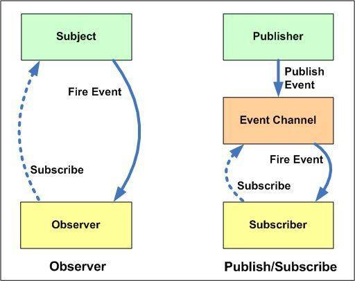

# 设计模式

## 观察者模式和订阅/发布模式的区别

### 观察者模式

观察者模式是软件设计模式的一种。在此种模式中， **一个目标对象管理所有相依于它的观察者对象，并且在它本身的状态改变时主动发出通知。** 这通常透过呼叫各观察者所提供的方法来实现。此种模式通常被用来实时事件处理系统。

### 订阅/发布模式

在软件架构中，发布-订阅是一种消息范式， **消息的发送者（称为发布者）不会将消息直接发送给特定的接收者（称为订阅者）。而是将发布的消息分为不同的类别，无需了解哪些订阅者（如果有的话）可能存在。**
同样的，订阅者可以表达对一个或多个类别的兴趣，只接收感兴趣的消息，无需了解哪些发布者（如果有的话）存在。

### 二者区别

角色角度来看，订阅发布模式需要三种角色，发布者、事件中心和订阅者。二观察者模式需要两种角色，目标和观察者，无事件中心负责通信。

从耦合度上来看，订阅发布模式是一个事件中心调度模式，订阅者和发布者是没有直接关联的，通过事件中心进行关联，两者是解耦的。而观察者模式中目标和观察者是直接关联的，耦合在一起（有些观念说观察者是解耦，解耦的是业务代码，不是目标和观察者本身）。



### 订阅/发布实例

```js
class Event {
  constructor() {
    // 所有 eventType 监听器回调函数（数组）
    this.listeners = {}
  }
  /**
   * 订阅事件
   * @param {String} eventType 事件类型
   * @param {Function} listener 订阅后发布动作触发的回调函数，参数为发布的数据
   */
  on(eventType, listener) {
    if (!this.listeners[eventType]) {
      this.listeners[eventType] = []
    }
    this.listeners[eventType].push(listener)
  }
  /**
   * 发布事件
   * @param {String} eventType 事件类型
   * @param {Any} data 发布的内容
   */
  emit(eventType, data) {
    const callbacks = this.listeners[eventType]
    if (callbacks) {
      callbacks.forEach((c) => {
        c(data)
      })
    }
  }
}

const event = new Event()
event.on('open', (data) => {
  console.log(data)
})
event.emit('open', { open: true })
```

### 观察者实例

```js
/**
 * 观察监听一个对象成员的变化
 * @param {Object} obj 观察的对象
 * @param {String} targetVariable 观察的对象成员
 * @param {Function} callback 目标变化触发的回调
 */
function observer(obj, targetVariable, callback) {
  if (!obj.data) {
    obj.data = {}
  }
  Object.defineProperty(obj, targetVariable, {
    get() {
      return this.data[targetVariable]
    },
    set(val) {
      this.data[targetVariable] = val
      // 目标主动通知观察者
      callback && callback(val)
    },
  })
  if (obj.data[targetVariable]) {
    callback && callback(obj.data[targetVariable])
  }
}
```
