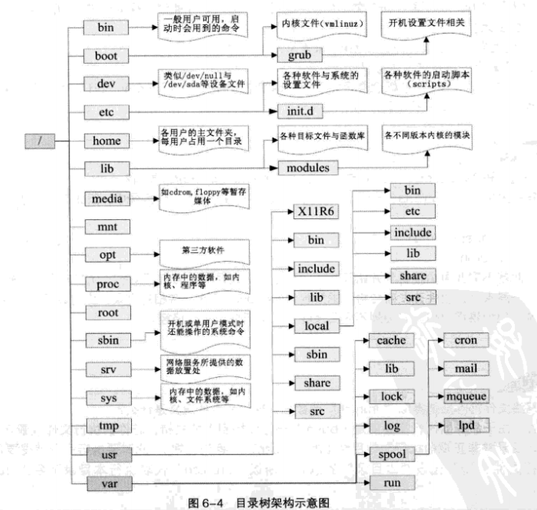

# 鸟哥的Linux私房菜基础学习篇

### 5.2.2

显示日期与时间的命令：date
显示日历的命令： cal
简单好用的计算器：bc

### 5.2.3

命令补齐&文件补齐：double Tab（空命令下 显示所有命令）
中断目前程序：Ctrl + c
键盘输入结束： Ctrl + d

### 5.3.1

man page

|代号|代表内容|
|---|---|
|1|用户在shell环境中可以操作的命令或可执行文件|
|2|系统内核和可调用的函数和工具等|
|3|一些常用的函数（function）与函数库（library）,大部分为C的函数库（libc）|
|4|配置文件的说明，通常在/dev下的文件|
|5|配置文件或者是某些文件的格式|
|6|游戏（games）|
|7|惯例与协议等，例如Linux文件系统、网络协议、ASCII code等说明|
|8|系统管理员可用的管理命令|
|9|跟kernel有关的文件|

### 5.5

查看目前在线用户：who
查看网络联机状态：netstat -a
查看后台执行程序：ps -aux

将数据同步写入硬盘中的命令：sync
惯用的关机命令：shutdown
重启、关机：reboot、halt、poweroff

### 6.2.2

chgrp: 改变文件所属用户组
chown: 改变文件所有者
chmod: 改变文件的权限

cp: 复制

### 6.2.4

#### 文件种类：(ls -l第一个字符为文件的类型)

- 普通文件(regular file)：由ls -al所显示出来的属性方面，第一个字符为[-]，例如[-rwxrwxrwx]。
  - 纯文本文件(ASCII)
  - 二进制文件(binary)
  - 数据格式文件(data)
- 目录(directory)：第一个属性为[d]，例如[drwxrwxrwx]。
- 连接文件(link)：类似Windows系统下的快捷方式，第一个属性为[l]。例如[lrwxrwxrwx]。
- 设备与设备文件(device)：与系统外设及存储相关的一些文件，通常都集中在/dev这个目录。通常又分为两种：
  - 块(block)设备文件：第一个属性为[b]。
  - 字符(character)设备文件：第一个属性为[c]。
- 套接字(sockets)：这种类型的文件通常被用在网络上的数据连接。第一个属性为[s]，通常在/var/run中卡看到这种文件。
- 管道(FIFO, pipe)：用于解决多程序访问同一文件错误问题，第一个属性为[p]。

#### Linux文件拓展名

- *.sh: 脚本或批处理文件(scripts)
- \*Z/\*.tar/*tar.gz/*.zip/*.tgz: 经过打包的压缩文件
- \*.html/\*.php: 网页相关文件

#### Linux文件长度限制

在Linux下，使用默认的Ext2/Ext3文件系统时，文件名长度限制为：

- 单一文件或目录的最大容许文件名为255个字符
- 包含完整路径名称及目录(/)的完整文件名为4096个字符

#### Linux文件名限制

- 避免字符: *?<>;&![]|\'"`(){}
- 小数点'.'开头文件为隐藏文件
- 避免 - + 影响-option命令参数

### 6.3.1

||可分享的|不可分享的|
|---|---|---|
|不变的|/usr(软件放置处)|/etc(配置文件)|
|不变的|/opt(第三方软件)|/boot(开机与内核文件)|
|可变动的|/var/mail(用户邮件信箱)|/var/run(程序相关)|
|可变动的|/var/spool/news(新闻组)|/var/lock(程序相关)|

/ (root,根目录): 与开机系统有关;
/usr (UNIX software resource): 与软件安装/执行有关;
/var (variable): 与系统运作过程有关。

根目录下应存在的目录:

|目录|应放置文件内容|
|---|---|
|/bin|/bin放置的是在单用户维护模式下还能够被操作的命令。在/bin下面的命令可以被root与一般账号所使用，主要有cat,chmod,chown,date,mv,mkdir,cp,bash等常用命令|
|/boot|这个目录主要放置开机会使用到的文件|
|/dev|在Linux系统上，任何设备与接口设备都是以文件的形式存在于这个目录当中的|
|/etc|系统主要的配置文件几乎都放置在这个目录中，一般来说这个目录下的文件属性是可以让一般用户查询的，但是只有root有权利修改|
|/home|系统默认的用户主文件夹，主文件夹有两种代号： ~:代表目前这个用户的主文件夹  ~dmtsai: 则代表dmtsai的主文件夹|
|/lib|放置开机时会用到的函数库以及在/bin或/sbin下面的命令会调用的函数库而已|
|/media|放置可删除的设备。包括软盘/光盘|
|/mnt|如果你想要挂在额外设备，一般建议放置在这个目录中。比较早的时候，这个目录的用途与/media相同|
|opt|这个是给第三方软件放置的目录。以前的Linux系统中，习惯于放置在/usr/local中|
|/root|系统管理员的主文件夹|
|/sbin|Linux有非常多的命令是用来设置系统环境的，这些命令只有root才能够利用来设置系统，其他用户最多只能用来查询而已。放在/sbin下面的为开机过程所需要的，里面包括了开机、修复、还原系统所需要的命令。至于某些服务器软件程序，一般放置在/usr/sbin/当中。至于本机自行安装的软件所产生的系统执行文件，在放置在/usr/local/sbin/当中。常见的命令包括fdisk、fsck、ifconfig、init、mkfs等|
|/srv|srv可以视为service的缩写，是一些网络服务启动之后，这些服务所需要取用的数据目录。www服务所需要的网页数据就可以放置在/srv/www/里面|
|/tmp|让一般用户或者是正在执行的程序暂时放置文件的地方。这个目录任何人都能够访问，所以需要定期清理|

### 6.3.2

### 6.3.3

- 绝对路径: 由根目录(/)开始邪气的文件名或目录名称，例如/home/dmtsai/.bashrc。
- 相对路径: 不是/开头的就属于相对路径。
  - .: 代表当前目录，也可以使用./来表示。
  - ..: 代表上一层目录，也可以../来表示。

### 7.1.2

常见处理目录的命令：

- cd: 切换目录
- pwd [-P]: 显示当前目录
  - -P: 显示出当前的路径，而非使用连接(link)的路径。
- mkdir [-mp] 目录名称: 新建一个新的目录
  - -m: 配置文件的权限。否则是默认属性(umask)。
  - -p: 帮助你直接将所需要的目录(包含上层目录)递归创建起来。
- rmdir [-p] 目录名称: 删除一个空的目录
  - -p: 连同上层的“空”目录也一起删除。

### 7.1.3

echo $PATH

### 7.2.1

ls [-aAdfFhilnrRSt] 目录名称

查看文件与目录

常用参数：

- -a: 全部文件，连同隐藏文件(开头为.的文件)一起列出来
- -d: 仅列出目录本身，而不是列出目录内的文件数据(常用)
- -l: 列出长数据串，包含文件的属性与权限等数据(常用)

### 7.2.2

cp [-adfilprsu] 源文件(source) 目标文件(destination)

复制文件与目录

常用参数:

- -a: 相当于-pdr的意思(参考后文)
- -i: 若目标文件已经存在时，在覆盖时会先询问操作的进行
- -r: 递归持续复制，用于目录的复制行为

rm [-fir] 文件或目录

移除文件或目录

参数:

- -f: 就是force的意思，忽略不存在的文件，不会出现警告信息
- -i: 互动模式，在删除前会询问用户是否操作
- -r: 递归删除，最常用的在目录的删除。(这是非常危险的参数)

mv [-fiu] 源文件 目标文件

移动文件或目录，或更名

参数:

- -f: force强制的意思，如果目标已经存在，不会询问而直接覆盖
- -i: 若目标文件已经存在时，就会选文是否覆盖
- -u: 若目标文件已经存在，且source比较新，才会更新

### 7.2.3

basename

取得文件名

dirname

取得目录名

### 7.3.1

cat [-AbEnTv] 文件

列示

常用参数:

- -n: 打印出行号，连同空白行也会有行号

tac

反向列示

nl [-bnw] 文件

添加行号打印

### 7.3.5

- modification time(mtime)

  当文件的内容数据更改时，更新这个时间：内容数据指的是文件的内容而非属性或权限

- status time(ctime)

  当文件的状态改变时，更新这个时间：例如权限与属性
  
- access time(atime)

  当该文件的内容被取用时，就会更新这个时间，例如cat读取文件
  
touch [-acdmt] 文件
  
修改文件时间

### 7.4.1

文件默认属性：umask

分数有四组值，第一个值的特殊权限所用

umask的分数指的是 该默认值需要减掉的权限

### 7.4.2

chattr [+-=] [ASacdistu] 文件或目录名称

设置文件的隐藏属性

常用参数：

- -a: 设置a后，文件只能增加数据，而不能删除也不能修改数据，只有root才能设置这个属性

- -i: 让一个文件不能被删除、改名。设置连接也无法写入或添加数据。对系统安全性有相当大的帮助。只有root能设置

lsattr [-adR] 文件或目录

显示文件隐藏属性