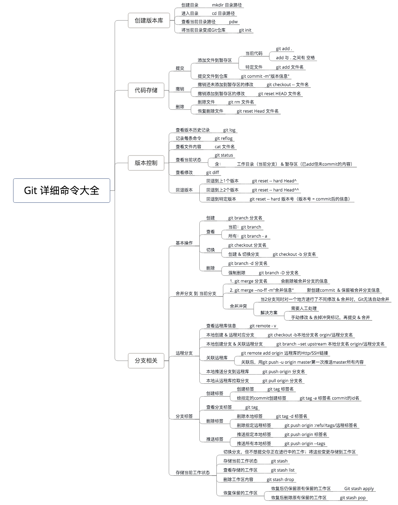

# Git相关介绍

## 基本概念

Git(读音为/gɪt/。)是一个开源的分布式版本控制系统，可以有效、高速的处理从很小到非常大的项目版本管理。Git 是 Linus Torvalds 为了帮助管理 Linux 内核开发而开发的一个开放源码的版本控制软件。

### 优势

① 本地是版本库的完整镜像，因此支持离线工作

② 绝大多数操作都只需要访问本地文件和资源，而且与每个提交都是所有文件的完整副本，因此速度非常快

## git流程


**Workspace**: 工作区

**Index / Stage**: 暂存区

**Repository**: 仓库区（或本地仓库）

**Remote**: 远程仓库

文件三种状态(modified, staged, committed)

## 常用命令



### 新建

```shell
# 在当前目录新建一个 Git 代码库
$ git init

# 新建一个目录，将其初始化为 Git 代码库
$ git init [project-name]

# 下载一个项目和它的整个代码历史
$ git clone [url]
```

### 配置

```shell
Git 的设置文件为.gitconfig，它可以在用户主目录下（全局配置），也可以在项目目录下（项目配置）。

# 显示当前的 Git 配置
$ git config --list

# 编辑 Git 配置文件
$ git config -e [--global]

# 设置提交代码时的用户信息
$ git config [--global] user.name "[name]"
$ git config [--global] user.email "[email address]"
```

### 增加删除文件

```shell
# 添加指定文件到暂存区
$ git add [file1] [file2] ...

# 添加指定目录到暂存区，包括子目录
$ git add [dir]

# 添加当前目录的所有文件到暂存区
$ git add .

# 删除工作区文件，并且将这次删除放入暂存区
$ git rm [file1] [file2] ...

# 停止追踪指定文件，但该文件会保留在工作区
$ git rm --cached [file]

# 改名文件，并且将这个改名放入暂存区
$ git mv [file-original] [file-renamed]
```

### 代码提交

```shell
# 提交暂存区到仓库区
$ git commit -m [message]

# 提交暂存区的指定文件到仓库区
$ git commit [file1] [file2] ... -m [message]

# 提交工作区自上次 commit 之后的变化，直接到仓库区
$ git commit -a

# 提交时显示所有 diff 信息
$ git commit -v

# 使用一次新的 commit，替代上一次提交
# 如果代码没有任何新变化，则用来改写上一次 commit 的提交信息
$ git commit --amend -m [message]

# 重做上一次 commit，并包括指定文件的新变化
$ git commit --amend   ...
```

### 分支

```shell
# 列出所有本地分支
$ git branch

# 列出所有远程分支
$ git branch -r

# 列出所有本地分支和远程分支
$ git branch -a

# 新建一个分支，但依然停留在当前分支
$ git branch [branch-name]

# 新建一个分支，并切换到该分支
$ git checkout -b [branch]

# 新建一个分支，指向指定 commit
$ git branch [branch] [commit]

# 新建一个分支，与指定的远程分支建立追踪关系
$ git branch --track [branch] [remote-branch]

# 切换到指定分支，并更新工作区
$ git checkout [branch-name]

# 建立追踪关系，在现有分支与指定的远程分支之间
$ git branch --set-upstream [branch] [remote-branch]

# 合并指定分支到当前分支
$ git merge [branch]

# 选择一个 commit，合并进当前分支
$ git cherry-pick [commit]

# 删除分支
$ git branch -d [branch-name]

# 删除远程分支
$ git push origin --delete
$ git branch -dr
```

### 标签

```shell
# 列出所有 tag
$ git tag

# 新建一个 tag 在当前 commit
$ git tag [tag]

# 新建一个 tag 在指定 commit
$ git tag [tag] [commit]

# 查看 tag 信息
$ git show [tag]

# 提交指定 tag
$ git push [remote] [tag]

# 提交所有 tag
$ git push [remote] --tags

# 新建一个分支，指向某个 tag
$ git checkout -b [branch] [tag]
```

### 查看信息

```shell
# 显示有变更的文件
$ git status

# 显示当前分支的版本历史
$ git log

# 显示 commit 历史，以及每次 commit 发生变更的文件
$ git log --stat

# 显示某个文件的版本历史，包括文件改名
$ git log --follow [file]
$ git whatchanged [file]

# 显示指定文件相关的每一次 diff
$ git log -p [file]

# 显示指定文件是什么人在什么时间修改过
$ git blame [file]

# 显示暂存区和工作区的差异
$ git diff

# 显示暂存区和上一个 commit 的差异
$ git diff --cached []

# 显示工作区与当前分支最新 commit 之间的差异
$ git diff HEAD

# 显示两次提交之间的差异
$ git diff [first-branch]...[second-branch]

# 显示某次提交的元数据和内容变化
$ git show [commit]

# 显示某次提交发生变化的文件
$ git show --name-only [commit]

# 显示某次提交时，某个文件的内容
$ git show [commit]:[filename]

# 显示所有分支的所有操作记录（包括commit和reset的操作），包括已经被删除的commit记录（可用于回复删除的数据）
$ git reflog
```

### 远程同步

```shell
# 下载远程仓库的所有变动
$ git fetch [remote]

# 显示所有远程仓库
$ git remote -v

# 显示某个远程仓库的信息
$ git remote show [remote]

# 增加一个新的远程仓库，并命名
$ git remote add [shortname] [url]

# 取回远程仓库的变化，并与本地分支合并
$ git pull [remote] [branch]

# 上传本地指定分支到远程仓库
$ git push [remote] [branch]

# 强行推送当前分支到远程仓库，即使有冲突
$ git push [remote] --force

# 推送所有分支到远程仓库
$ git push [remote] --all
```

### 撤销

```shell
# 恢复暂存区的指定文件到工作区
$ git checkout [file]

# 恢复某个 commit 的指定文件到工作区
$ git checkout [commit] [file]

# 恢复上一个 commit 的所有文件到工作区
$ git checkout .

# 重置暂存区的指定文件，与上一次 commit 保持一致，但工作区不变
$ git reset [file]

# 重置暂存区与工作区，与上一次 commit 保持一致
$ git reset --hard

# 重置当前分支的指针为指定 commit，同时重置暂存区，但工作区不变
$ git reset [commit]

# 重置当前分支的 HEAD 为指定 commit，同时重置暂存区和工作区，与指定 commit 一致
$ git reset --hard [commit]

# 重置当前 HEAD 为指定 commit，但保持暂存区和工作区不变
$ git reset --keep [commit]

# 新建一个 commit，用来撤销指定 commit
# 后者的所有变化都将被前者抵消，并且应用到当前分支
$ git revert [commit]
```

### 变基*

- 不同分支间用于合并分支，将本分支的commits顶到最顶端(没有合并的痕迹，合并后的分支看起来像是只在一个分支上开发的)

- 单独分支使用可以调整分支上的commits(合并/删除/修改commits信息等功能)

```shell
# 将某个分支变基到当前分支的最顶端(最新)
$ git rebase [branch]

# 解决冲突后，继续rebase
$ git rebase --continue

# 终止rebase
$ git rebase --abort

# 将指定区间的提交复制到某个分支上
$ git rebase -i [startpoint]  [endpoint]] --onto  [branchName]

$ 对HEAD后面的n条commits做变基处理
# git rebase -i HEAD~n
```

其中-i的意思是--interactive，即弹出交互式的界面让用户编辑完成合并操作

[startpoint]  [endpoint]则指定了一个编辑区间，如果不指定[endpoint]，则该区间的终点默认是当前分支HEAD所指向的commit(注：该区间指定的是一个前开后闭的区间)

--onto的意思是要将该指定的提交复制到哪个分支上

### 其他

```shell
# 生成一个可供发布的压缩包
$ git archive
```

参考:

- [稀土技术团队博客: http://xitu.github.io/2016/04/06/git-start](http://xitu.github.io/2016/04/06/git-start/)
- [Git rebase 用法小结: https://www.jianshu.com/p/4a8f4af4e803](https://www.jianshu.com/p/4a8f4af4e803)

## gitflow


**master**: 线上稳定版本分支(tag标记版本)

**hotfix**: 快速修复bug的分支(修改后合并到master和develop分支中)

**release**: 预发布分支(develop开发完成后在release进行上线预演)

**develop**: 开发分支(开发主干分支，从该分支拉去新的feature分支进行新功能开发)

**feature**: 功能分支(单独的功能开发分支)

待续...
